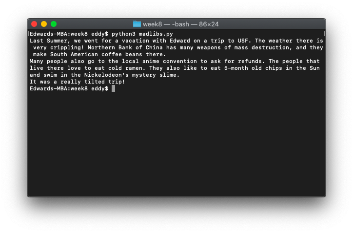
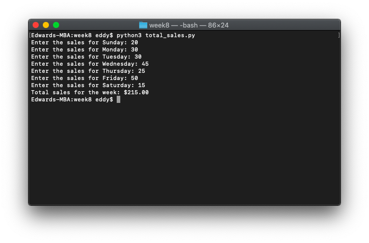

# Week 10

*October 26, 2021 – November 1, 2021*

## In-Class Exercise 11

### Part 1: Mad Libs

Write a program `madlibs.py` that generates a Mad Lib of the story below.

Each option has a list of 3 choices that will be picked at random. For example, for the first blank, create a list of 3 people and choose one at random (using `randint`) for each Mad Lib. Please don’t use `random.choice`. You want to use a different random number for each list.

> Last Summer, we went for a vacation with __________ (person) on a trip to __________ (place). The weather there is very __________ (adjective)! Northern __________ (place) has many __________ (plural noun), and they make __________ (plural noun) there.
> 
> Many people also go to the __________ (different place) to __________ (action verb). The people that live there love to eat __________ (food). They also like to __________ (action) in the sun and swim in the __________ (noun).
> 
> It was a really __________ (adjective) trip!

The lists you will want are:

- `people`
- `places`
- `adjectives`
- `more_adjectives`
- `plural_nouns`
- `more_plural_nouns`
- `diff_places`
- `action_verbs`
- `more_action_verbs`
- `foods`
- `nouns`

You can have three elements per list.

```python
import random

random_people = ['Edward', 'Benny', 'Ian']
random_places = ['USF', 'Venezuela', 'the void']
random_adjectives = ['sussy', 'unfortunate', 'crippling']
more_adjectives = ['unlucky', 'tilted', 'broken']
plural_nouns = ['weapons of mass destruction', 'quantum computers stolen from China', 'resold NVIDIA graphics cards']
more_plural_nouns = ['South American coffee beans', 'awful jokes', 'CS homework assignments']
diff_places = ['Bank of China', 'New York Stock Exchange', 'local anime convention']
action_verbs = ['watch the wind go by', 'ask for refunds', 'sit in regret']
more_action_verbs = ['burn', 'eat 5-month old chips', 'lay and ponder their life choices']
foods = ['cold ramen', 'Brussels sprouts', 'meatloaf from yesterday']
nouns = ['Nutella', 'Nickelodeon\'s mystery slime', 'public pool']

print('Last Summer, we went for a vacation with ' + random_people[random.randint(0, 2)] + ' on a trip to ' +
      random_places[random.randint(0, 2)] + '. The weather there is very ' + random_adjectives[random.randint(0, 2)] +
      '! Northern ' + diff_places[random.randint(0, 2)] + ' has many ' + plural_nouns[random.randint(0, 2)] +
      ', and they make ' + more_plural_nouns[random.randint(0, 2)] + ' there.')
print('Many people also go to the ' + diff_places[random.randint(0, 2)] + ' to ' + action_verbs[random.randint(0, 2)] +
      '. The people that live there love to eat ' + foods[random.randint(0, 2)] + '. They also like to ' +
      more_action_verbs[random.randint(0, 2)] + ' in the Sun and swim in the ' + nouns[random.randint(0, 2)] + '.')
print('It was a really ' + more_adjectives[random.randint(0, 2)] + ' trip!')
```



### Part 2: Weekly Sales

Write a Python program `total_sales.py` that asks the user to enter a store's sales for each day of the week, then calculates the total sales for the week and displays the result.

Your program should have the following elements:

- Initialize a list `daily_sales` with 7 elements containing `0.00` (one for each day of the week).
- Initialize a list `days_of_week` with 7 elements, each one is a day of the week.
- Use a loop to ask for user input for each day's sales (i.e. to fill your list `daily_sales`). You will ask the user, "Enter the sales for [day of week]," using the list `days_of_week`. You will input each entry into the list `daily_sales`.
- Calculate the total sales using the list `daily_sales` with a loop.
- Print, "Total sales for the week: $ ," to two decimal places.

**Please don't use `append`.**

```python
daily_sales = [0.00, 0.00, 0.00, 0.00, 0.00, 0.00, 0.00]
days_of_week = ['Sunday', 'Monday', 'Tuesday', 'Wednesday', 'Thursday', 'Friday', 'Saturday']
sales_of_the_week = 0.00

for position in range(len(days_of_week)):
    sales_of_the_day = float(input('Enter the sales for ' + days_of_week[position] + ': '))
    daily_sales[position] = sales_of_the_day

for amount in daily_sales:
    sales_of_the_week += float(amount)

print('Total sales for the week: $' + format(sales_of_the_week, '.2f'))
```


