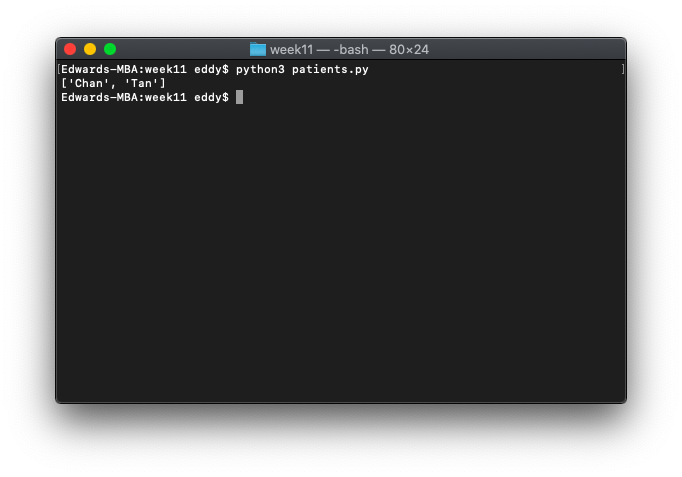
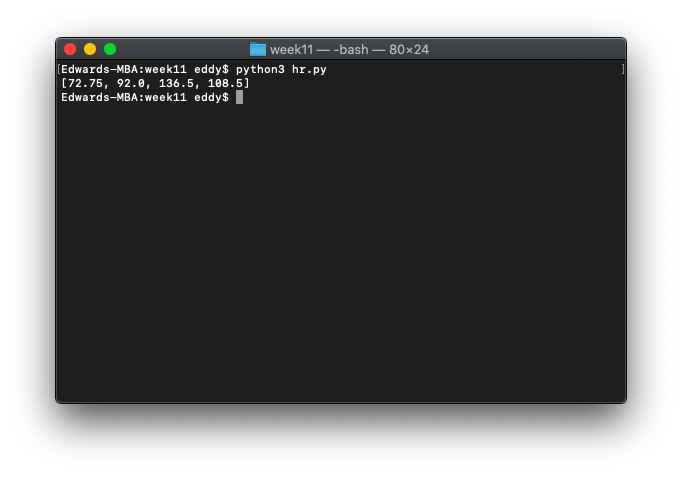

# Week 11

*November 2, 2021 – November 8, 2021*

## 🩺 In-Class Exercise 12

### Part 1: Patients

You have the following list of lists:

```python
patients = [['Milos', 'Jones', 48, 'male', 'smoker', 210],
            ['Delia', 'Chan', 39, 'female', 'non-smoker', 170],
            ['Dan', 'Ross', 62, 'male', 'non-smoker', 200],
            ['Samantha', 'Tan', 28, 'female', 'non-smoker', 180]]
```

Each sub-list contains a hospital patient's first name, last name, age, gender, whether they are a smoker, and weight as elements.

Write a Python program `patients.py`, **where you iterate through the list of lists `patients` and append the *last name* of all *female* patients to a new list `female_patients` and display `female_patients`.

**Please do this with one for loop.**

```python
patients = [['Milos', 'Jones', 48, 'male', 'smoker', 210],
            ['Delia', 'Chan', 39, 'female', 'non-smoker', 170],
            ['Dan', 'Ross', 62, 'male', 'non-smoker', 200],
            ['Samantha', 'Tan', 28, 'female', 'non-smoker', 180]]

female_patients = []

for patient in patients:
    if patient[3] == 'female':
        female_patients.append(patient[1])

print(female_patients)
```



### Part 2: Heart Rates

You have the following list of lists:

```python
heart_rates = [[72, 75, 71, 73],  # resting
               [91, 90, 94, 93],  # walking slowly
               [130, 135, 139, 142],  # running on treadmill
               [120, 118, 110, 105, 100, 98]]  # after a minute of recovery
```

Each element of the sublists is the heart rate of a patient. Each sub-list contains heart rates of patients after resting, walking, running, and a minute after recovery. Not all sub-lists are of the same length.

Write a Python program `hr.py` **where you iterate through the list of lists `hr` and calculate the average of each sub-list. Append the average of each sub-list to a new list as you iterate through `hr`. Print this list of average heart rates at the end.

**You will need to use a nested for loop.**

```python
heart_rates = [[72, 75, 71, 73],  # resting
               [91, 90, 94, 93],  # walking slowly
               [130, 135, 139, 142],  # running on treadmill
               [120, 118, 110, 105, 100, 98]]  # after a minute of recovery

hr_averages = []

for hr_set in heart_rates:
    hr_set_sum = 0
    for hr in hr_set:
        hr_set_sum += hr
    hr_averages.append(hr_set_sum / len(hr_set))

print(hr_averages)
```


