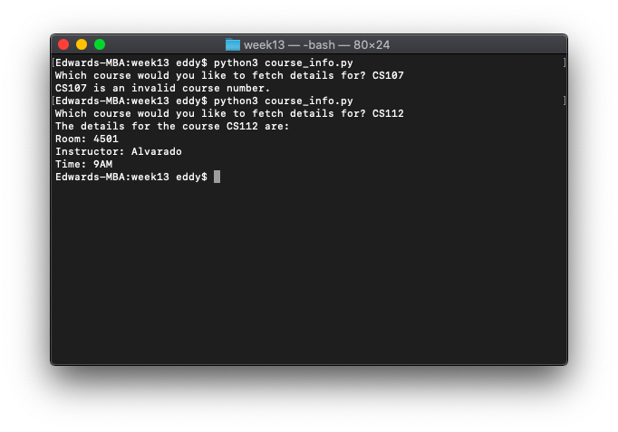

# Week 13

*November 16, 2021 – November 22, 2021*

## 🚪 In-Class Exercise 13

Write a Python program `course_info.py` that creates a dictionary containing course numbers and the room numbers of the rooms where the course meets. The dictionary should have the following key-value pairs (where room numbers are integers):

| Course Number (Key) | Room Number (Value) |
| --- | --- |
| CS110 | 3004 |
| CS112 | 4501 |
| CS220 | 6755 |
| CS245 | 1244 |
| CS212 | 1411 |

The program should also create a dictionary containing course numbers and the names of the instructors that teach each course. The dictionary should have the following key-value pairs:

| Course Number (Key) | Instructor (Value) |
| --- | --- |
| CS110 | Haynes |
| CS112 | Alvarado |
| CS220 | Rich |
| CS245 | Burke |
| CS212 | Lee |

The program should also create a dictionary containing instructors and the meeting times of each course. The dictionary should have the following key-value pairs:

| Instructor (Key) | Meeting Time (Value) |
| --- | --- |
| Haynes | 8AM |
| Alvarado | 9AM |
| Rich | 10AM |
| Burke | 11AM |
| Lee | 12PM |

You can hard-code the above dictionaries. The course numbers, instructors, and meeting times are strings and the room numbers are integers.

The program should let the user enter a course number, then it should display the course's room number, instructor, and meeting time. Case-sensitivity is fine. If the course is not valid, it should print, "[course number] is an invalid course number" (no loop needed if the course is invalid). Put all the code in a `main` function.

Example — if the user enters "CS110" the program should print out:

```
The details for the course CS110 are:

Room: 3004
Instructor: Haynes
Time: 8AM
```

```python
room_numbers = {
    'CS110': 3004,
    'CS112': 4501,
    'CS220': 6755,
    'CS245': 1244,
    'CS212': 1411
}
instructors = {
    'CS110': 'Haynes',
    'CS112': 'Alvarado',
    'CS220': 'Rich',
    'CS245': 'Burke',
    'CS212': 'Lee'
}
meeting_times = {
    'Haynes': '8AM',
    'Alvarado': '9AM',
    'Rich': '10AM',
    'Burke': '11AM',
    'Lee': '12PM'
}


def main():
    query = input('Which course would you like to fetch details for? ')
    if query in room_numbers:
        query_room_number = room_numbers.get(query)
        query_instructor = instructors.get(query)
        query_meeting_time = meeting_times.get(query_instructor)
        print('The details for the course ' + query + ' are:')
        print('Room: ' + str(query_room_number))
        print('Instructor: ' + query_instructor)
        print('Time: ' + query_meeting_time)
    else:
        print(query + ' is an invalid course number.')


main()
```


