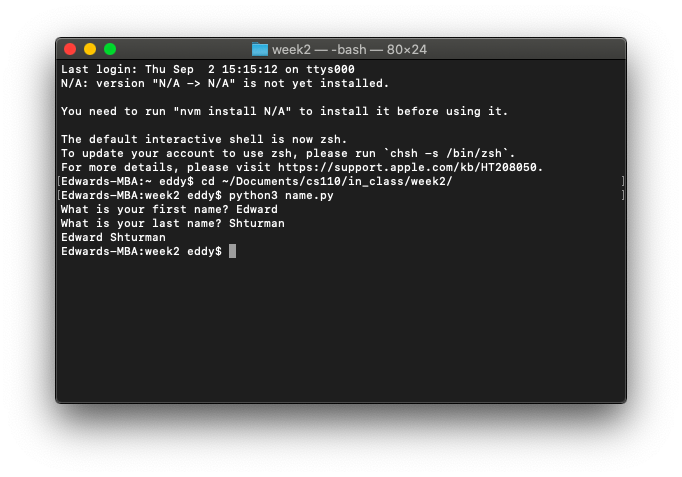
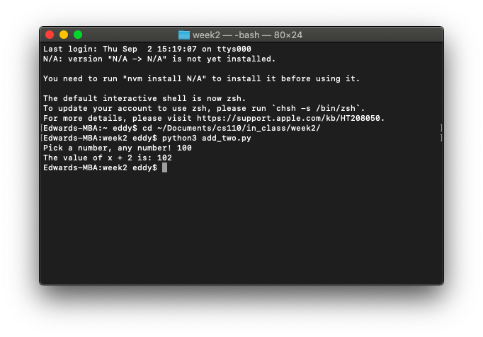
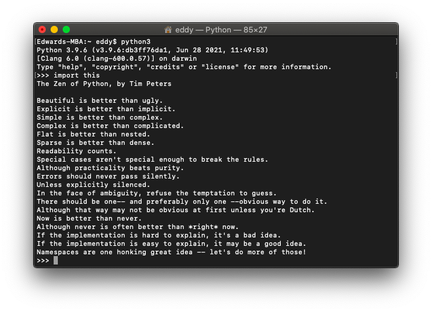

# Week 2

*August 31, 2021 – September 6, 2021*

## 🐶 In-Class Exercise 1

### Part 1: Printing a user's name

Write a Python program `name.py` that does the following:

- Asks the user to enter their first name.
- Asks the user to enter their last name.
- Print their first and last name together, e.g., `Sophie Wilson`.

```python
first_name = input('What is your first name? ')
last_name = input('What is your last name? ')
print(first_name, last_name)
```



### Part 2: Adding two to user input

Write a Python program `add_two.py` that takes a user's input into a variable and adds 2 to it. Steps for the algorithm are:

- Ask for input for an integer, call the variable `x`.
- Add two to `x`.
- Print out `'The value of x + 2 is: '` and the value of `x + 2`.

```python
x = int(input('Pick a number, any number! '))
print('The value of x + 2 is:', x + 2)
```



### Part 3: Converting dog years to human years

Each year of a dog's life is equivalent to about seven years of a human's life.

Write a Python program `dog_years.py` that converts dog years to human years.

Steps for the algorithm are:

- Ask for input for the dog's age with `'Dog age?'`
- Print the human years on the screen in this format:

`'Age in human years: '` and the dog's age calculated in human years.

```python
dog_age = int(input('Dog age? '))
human_age = (dog_age * 7)
print('Age in human years:', human_age)
```


### Extra credit: Zen of Python

What is the command to find the Zen of Python in the Python Shell?

What is your favorite line from the Zen of Python?

```python
import this
```



My favorite line is:

> Now is better than never.

Cliché but applicable to many aspects of life outside of programming. 🙂
