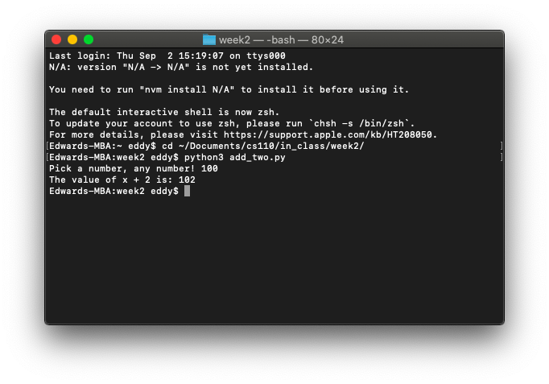
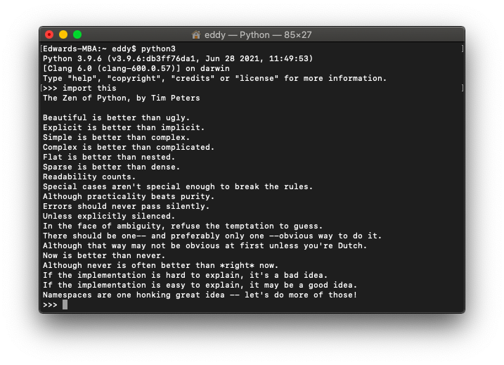

# In-Class Exercise 1

### Part 1: Printing a user's name

```python
first_name = input('What is your first name? ')
last_name = input('What is your last name? ')
print(first_name, last_name)
```


### Part 2: Adding two to user input

```python
x = int(input('Pick a number, any number! '))
print('The value of x + 2 is:', x + 2)
```



### Part 3: Converting dog years to human years

```python
dog_age = int(input('Dog age? '))
human_age = (dog_age * 7)
print('Age in human years:', human_age)
```


### Extra credit: Zen of Python



My favorite line is:

> Now is better than never.

Cliché but applicable to many aspects of life outside of programming. 🙂
