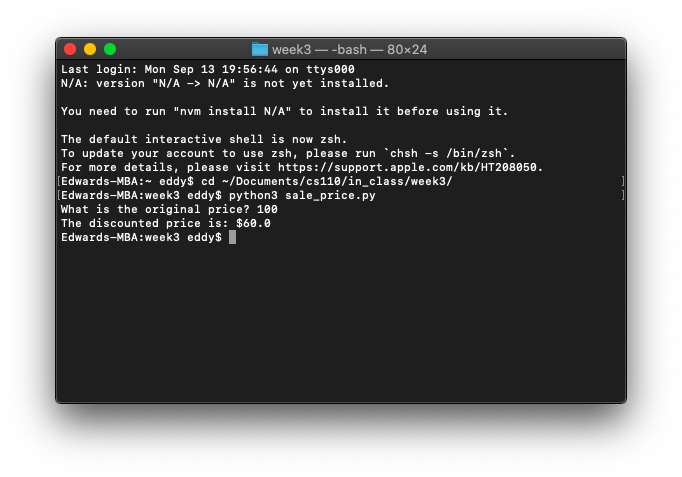
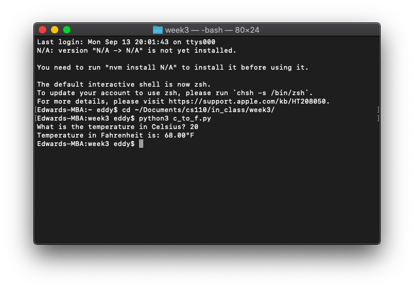
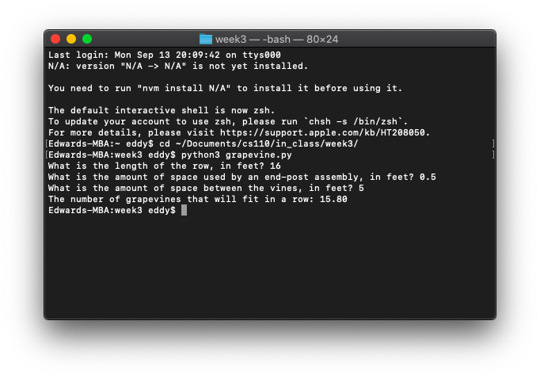
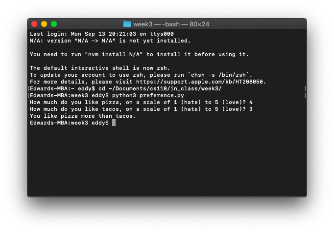
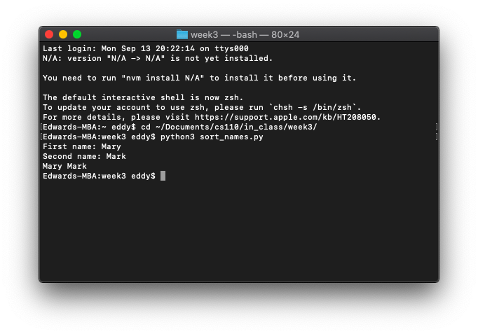
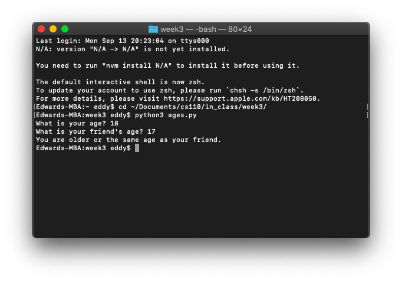

# Week 3

*September 7, 2021 – September 13, 2021*

## 🍇 In-Class Exercise 2

### Part 1: Printing sale price

Write a Python program `sale_price.py` that does the following:

- Gets the original price of an item as input.
- Calculates the discounted price with a 40% discount.
- Prints the sale prices as output in the correct format (ex: `$2.45`).

```python
original_price = float(input('What is the original price? '))
discounted_price = original_price * (60 / 100)
print('The discounted price is: $' + str(discounted_price))
```



### Part 2: Converting Celsius to Fahrenheit

Write a Python program `c_to_f.py` that converts a given temperature in Celsius to Fahrenheit.

Steps for the algorithm are:

- Input the temperature in Celsius.
- Output Fahrenheit to 2 decimal places in this format: `'Temperature in Fahrenheit is: '` and the temp in F using this formula: `F = (9/5) * Celsius + 32`

```python
temp_celsius = float(input('What is the temperature in Celsius? '))
temp_fahrenheit = (9 / 5) * temp_celsius + 32
print('Temperature in Fahrenheit is: ' + format(temp_fahrenheit, '.2f') + '°F')
```



### Part 3: Calculating percentage of CS majors vs. non-CS majors

Write a program `percentages.py` that asks the user for the number of CS majors and the number of non-CS majors registered in a class. The program should display the percentage of CS majors and non-CS majors in the class to 2 decimal places, along with the % sign with no space.

Hint: Suppose there are 8 CS majors and 12 non-CS majors in a class. There are 20 students in the class. The percentage of CS majors can be calculated as 8 ÷ 20 = 0.4, or 40%. The percentage of non-CS majors can be calculated as 12 ÷ 20 = 0.6, or 60%.

```python
cs_majors = int(input('How many CS majors are in the class? '))
non_cs_majors = int(input('How many non-CS majors are in the class? '))

total_students = cs_majors + non_cs_majors

cs_majors_percentage = cs_majors / total_students * 100
non_cs_majors_percentage = non_cs_majors / total_students * 100

print(format(cs_majors_percentage, '.2f') + '% of the class is composed of CS majors, while ' + format(non_cs_majors_percentage, '.2f') + '% of students in the class are not CS majors.')
```


### Extra Credit: Vineyards

A vineyard owner is planting several new rows of grapevines, and needs to know how many grapevines to plant in each row. She has determined that after measuring the length of a future row, she can use the following formula to calculate the number of vines that will fit in the row, along with the trellis end-post assemblies that will need to be constructed at each end of the row:

`V = (R - 2E) / S`

The terms in the formula are:

- V is the number of grapevines that will fit in the row.
- R is the length of the row, in feet.
- E is the amount of space, in feet, used by an end-post assembly.
- S is the space between vines, in feet.

Write a program `grapevine.py` that makes the calculation for the vineyard owner. The program should ask the user to input the following:

- The length of the row, in feet.
- The amount of space used by an end-post assembly, in feet.
- The amount of space between the vines, in feet.

Once the input data has been entered, the program should calculate and display the number of grapevines that will fit in the row to 2 decimal places.

**Hint:** you will want to think about what data type your user's input will be.

For example, your program would look like this with the following values:

Enter the length of the row, in feet: `50`

Enter the amount of space, in feet, used by an end-post assembly: `0.5`

Enter the distance, in feet, between each vine: `12.2`

You have enough space for `4.02` vines.

```python
row_length = float(input('What is the length of the row, in feet? '))
end_post_space = float(input('What is the amount of space used by an end-post assembly, in feet? '))
vine_room = float(input('What is the amount of space between the vines, in feet? '))

grapevines = format(row_length - (2 * end_post_space) / vine_room, '.2f')
print('The number of grapevines that will fit in a row:', grapevines)
```



## 🌮 In-Class Exercise 3

### Part 1: Pizza vs. taco preference

Write a Python program `preference.py` to:

- Ask the user `'How much do you like pizza on a scale of 1 (hate) to 5 (love)?'`
- Ask the user `'How much do you like tacos on a scale of 1 (hate) to 5 (love)?'`
- Print, if users like pizza more than tacos, `'You like pizzas more than tacos.'` (You do not need an else condition.)

```python
pizza_preference = int(input('How much do you like pizza, on a scale of 1 (hate) to 5 (love)? '))
taco_preference = int(input('How much do you like tacos, on a scale of 1 (hate) to 5 (love)? '))
if pizza_preference > taco_preference:
    print('You like pizza more than tacos.')
```



### Part 2: Sorting names by ASCII value

Write a Python program `sort_names.py` where the user enters two names and you print them in sorted order, lowest to highest (lowest means the word with the lowest ASCII code value, e.g., Mark < Mary), i.e. in alphabetical order. You should print it in the format: `firstname, secondname`.

```python
first_name = input('First name: ')
second_name = input('Second name: ')
if first_name > second_name:
    print(first_name, second_name)
elif second_name > first_name:
    print(second_name, first_name)
else:
    print('Error in calculation.')
```



### Part 3: Age comparison

Write a Python program `ages.py` where the user enters their age and their friend's age. If the user's age is bigger or equal to their friend's age, print `'You are older or the same age as your friend.'` If the friend is older, print `'Your friend is older than you.'`.

```python
user_age = int(input('What is your age? '))
friend_age = int(input('What is your friend\'s age? '))
if user_age >= friend_age:
    print('You are older or the same age as your friend.')
elif friend_age > user_age:
    print('Your friend is older than you.')
else:
    print('Error in calculation.')
```


