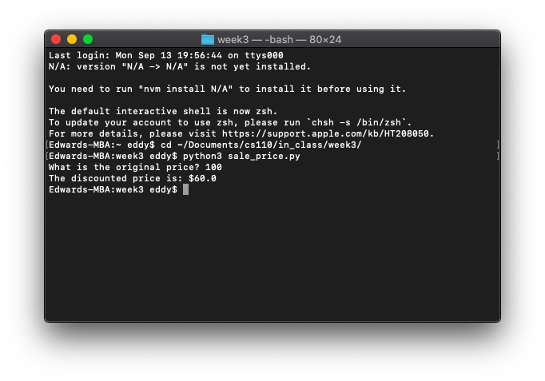
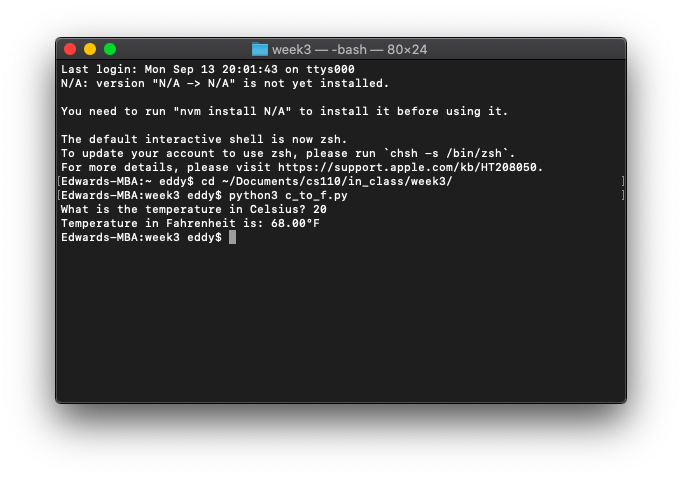
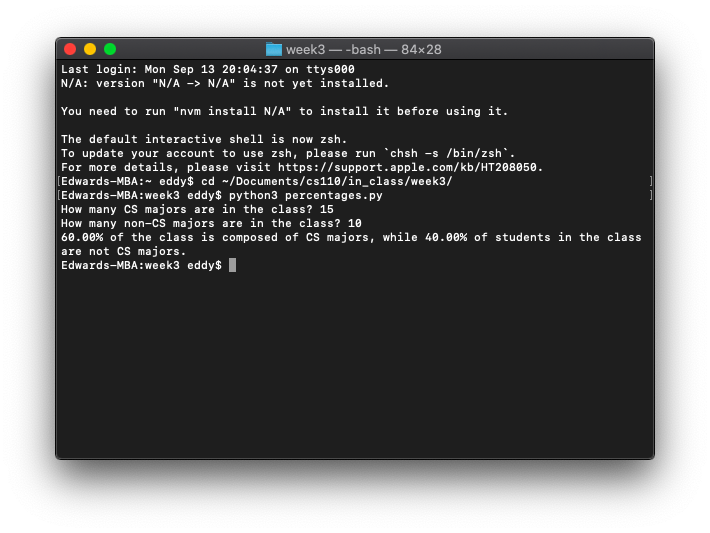
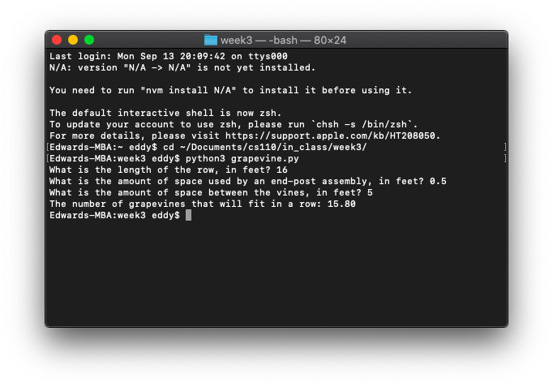

# In-Class Exercise 2

### Part 1: Printing sale price

```python
original_price = float(input('What is the original price? '))
discounted_price = original_price * (60 / 100)
print('The discounted price is: $' + str(discounted_price))
```



### Part 2: Converting Celsius to Fahrenheit

```python
temp_celsius = float(input('What is the temperature in Celsius? '))
temp_fahrenheit = (9 / 5) * temp_celsius + 32
print('Temperature in Fahrenheit is: ' + format(temp_fahrenheit, '.2f') + '°F')
```



### Part 3: Calculating percentage of CS majors vs. non-CS majors

```python
cs_majors = int(input('How many CS majors are in the class? '))
non_cs_majors = int(input('How many non-CS majors are in the class? '))

total_students = cs_majors + non_cs_majors

cs_majors_percentage = cs_majors / total_students * 100
non_cs_majors_percentage = non_cs_majors / total_students * 100

print(format(cs_majors_percentage, '.2f') + '% of the class is composed of CS majors, while ' + format(non_cs_majors_percentage, '.2f') + '% of students in the class are not CS majors.')
```



### Extra Credit: Vineyards

```python
row_length = float(input('What is the length of the row, in feet? '))
end_post_space = float(input('What is the amount of space used by an end-post assembly, in feet? '))
vine_room = float(input('What is the amount of space between the vines, in feet? '))

grapevines = format(row_length - (2 * end_post_space) / vine_room, '.2f')
print('The number of grapevines that will fit in a row:', grapevines)
```


