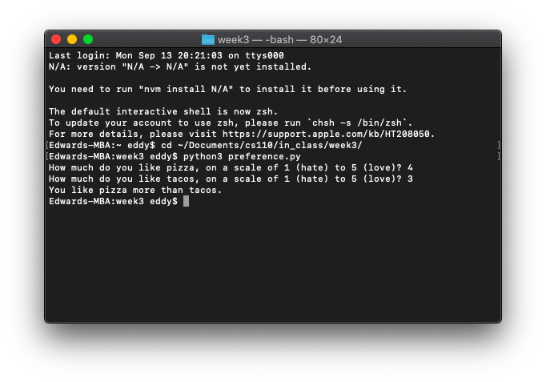
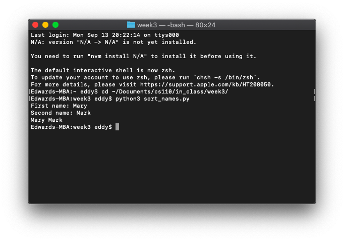
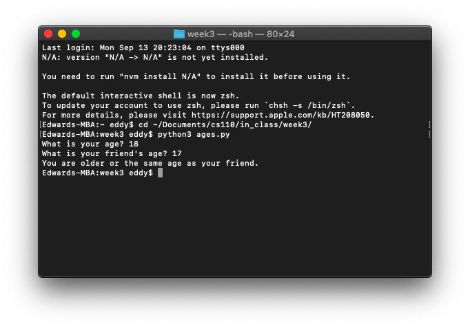

# In-Class Exercise 3

### Part 1: Pizza vs. taco preference

```python
pizza_preference = int(input('How much do you like pizza, on a scale of 1 (hate) to 5 (love)? '))
taco_preference = int(input('How much do you like tacos, on a scale of 1 (hate) to 5 (love)? '))
if pizza_preference > taco_preference:
    print('You like pizza more than tacos.')
```



### Part 2: Sorting names by ASCII value

```python
first_name = input('First name: ')
second_name = input('Second name: ')
if first_name > second_name:
    print(first_name, second_name)
elif second_name > first_name:
    print(second_name, first_name)
else:
    print('Error in calculation.')
```



### Part 3: Age comparison

```python
user_age = int(input('What is your age? '))
friend_age = int(input('What is your friend\'s age? '))
if user_age >= friend_age:
    print('You are older or the same age as your friend.')
elif friend_age > user_age:
    print('Your friend is older than you.')
else:
    print('Error in calculation.')
```

