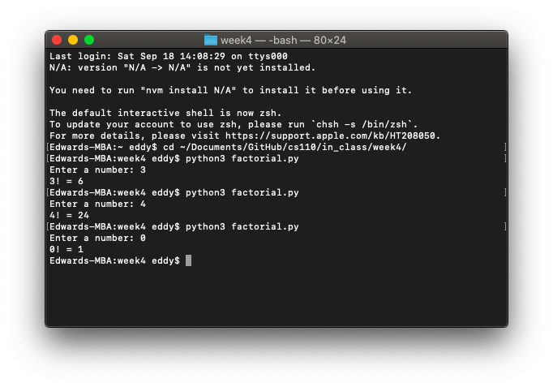

# Week 4

*September 14, 2021 — September 20, 2021*

## In-Class Exercise 4

### Part 1: Converting currency

Write a program `convert_money.py` that prompts the user like this:

> ```text
> Currency to convert to U.S. Dollars:
>
> 
> e = Euros
> 
> c = Chinese Yuan
> 
> r = Indian Rupees
> 
> b = Bitcoin
> ```

Then depending on which letter the user enters, the program displays `'Amount of Euros/Yuan/Rupees/Bitcoin to convert: '`.

(Note: the second prompt should only name the **one** currency the user asked to convert, not all four currencies.)

After the user enters the amount, the program displays the amount converted to U.S. Dollars to 2 decimal places, e.g. `'In U.S. dollars, that is $24.83'`.

Conversion rates (from Google, Aug 6, 2018):

- 1 Euro = 1.16 U.S. Dollars
- 1 Chinese Yuan = 0.15 U.S. Dollars
- 1 Indian Rupee = 0.015 U.S. Dollars
- 1 Bitcoin = 6923.80 U.S. Dollars

```python
currency_to_convert = input('Currency to convert to U.S. dollars:\n\'e\' = Euros\n\'c\' = Chinese Yuan\n\'r\' = '
                            'Indian Rupees\n\'b\' = Bitcoin\n\n')
if currency_to_convert == 'e':
    euro_convert = float(input('Amount of Euros to convert: '))
    print('In U.S. dollars, that is $' + format(euro_convert * 1.16, '.2f') + '.')
elif currency_to_convert == 'c':
    yuan_convert = float(input('Amount of Yuan to convert: '))
    print('In U.S. dollars, that is $' + format(yuan_convert * 0.15, '.2f') + '.')
elif currency_to_convert == 'r':
    rupee_convert = float(input('Amount of Rupees to convert: '))
    print('In U.S. dollars, that is $' + format(rupee_convert * 0.015, '.2f') + '.')
elif currency_to_convert == 'b':
    bitcoin_convert = float(input('Amount of Bitcoin to convert: '))
    print('In U.S. dollars, that is $' + format(bitcoin_convert * 6923.80, '.2f') + '.')
else:
    print('You need to enter either \'e\', \'c\', \'r\', or \'b\'!')
```


### Part 2: Determining the state of water based on its temperature

Write a program `water.py` that asks for temperature in Fahrenheit. The program should accept any floating point number. Display whether water is liquid, solid, or gas at that temperature at sea level. Display the results like this: `'Water at that temperature is a solid/liquid/gas.'`

(Note: display only the correct state for that temperature.)

Facts: At sea level, water freezes at 32 degrees F and boils at 212 degrees F.

Extra credit: 1 point if you convert the temperatures to celsius when printing.

```python
temperature_f = int(input('What is the temperature? '))
temperature_c = int((temperature_f - 32) * 5/9)
if temperature_f <= 32:
    print('Water at temperature ' + str(temperature_c) + '°C is a solid, as it has frozen.')
elif temperature_f >= 212:
    print('Water at temperature ' + str(temperature_c) + '°C is a gas, as it has evaporated.')
else:
    print('Water at temperature ' + str(temperature_c) + '°C is a liquid, as it has neither frozen nor evaporated.')
```


### Part 3: Classifying an individual's age

Using logical operators, write a program `classify_age.py` that asks the user to enter a person's age. Then, the program should display text indicating whether the person is an infant, a toddler, a child, a teenager, an adult, or a senior. It should display it just like this: `'This person’s age category: x'`, where x is the person’s age category based on the following guidelines:

- If less than 1 year old, the person is an infant.
- If at least 1 year old but younger than 3, the person is a toddler.
- If at least 3 years old but younger than 13, the person is a child.
- If at least 13 years old but younger than 18, the person is a teenager.
- If at least 18 years old but younger than 65, the person is an adult.
- If 65 or older, the person is a senior.

```python
age = float(input('What is the person\'s age? '))  # Normally would be type int but set to float to account for months
if age < 1:
    print('This person\'s age category: Infant')
elif age >= 1 and age < 3:
    print('This person\'s age category: Toddler')
elif age >= 3 and age < 13:
    print('This person\'s age category: Child')
elif age >= 13 and age < 18:
    print('This person\'s age category: Teenager')
elif age >= 18 and age < 65:
    print('This person\'s age category: Adult')
elif age >= 65:
    print('This person\'s age category: Senior')
```


## In-Class Exercise 5

### Part 1: Adding two

Write a program `add_two.py` starting with `i = 1`, using a while loop to add `2` on each iteration of the loop until it reaches (including) `9`. Print the value of `i` on each iteration.

(It is up to you whether you want to print `i` when it is equal to 1.)

```python
i = 1
while i < 9:
    print(i)
    i+=2
print (i)
```


### Part 2: Computing the sum of a range

Write a program `sum_range.py`. This code should prompt the user for two integers: `a` and `b`, and compute the sum of all integers greater than or equal to `a`, and less than or equal to `b`. If `a` is not less than `b`, your program should print out an error message. I would definitely recommend making your program work without worrying about the error message first.

```python
a = int(input('Enter an integer for the lower limit: '))
b = int(input('Enter an integer for the upper limit: '))

if a >= b:
    print('Error: ' + str(a) + ' > ' + str(b))

elif a < b:

    total = 0

    for n in range(a, b + 1, 1):
        total += n
    print(total)
```


### Part 3: Calculating the factorial

Write a program `factorial.py`. This code should prompt the user for a value, and then compute (and print out) the factorial of that value.

Recall that `n! = n * (n-1) * (n-2) ... * 1`. `0!` is defined to be `1`.

```python
n = int(input('Enter a number: '))

value = 1

for num in range(n, 1, -1):
    value *= num
print(str(n) + '! = ' + str(value))
```


