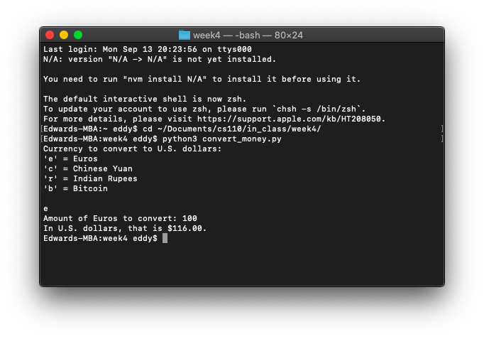
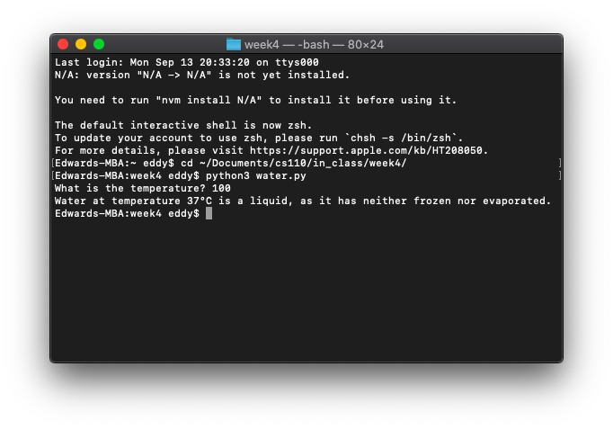
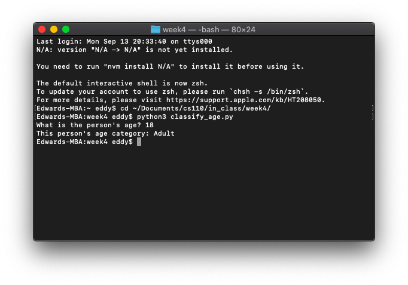

# In-Class Exercise 4

### Part 1: Converting currency

```python
currency_to_convert = input('Currency to convert to U.S. dollars:\n\'e\' = Euros\n\'c\' = Chinese Yuan\n\'r\' = '
                            'Indian Rupees\n\'b\' = Bitcoin\n\n')
if currency_to_convert == 'e':
    euro_convert = float(input('Amount of Euros to convert: '))
    print('In U.S. dollars, that is $' + format(euro_convert * 1.16, '.2f') + '.')
elif currency_to_convert == 'c':
    yuan_convert = float(input('Amount of Yuan to convert: '))
    print('In U.S. dollars, that is $' + format(yuan_convert * 0.15, '.2f') + '.')
elif currency_to_convert == 'r':
    rupee_convert = float(input('Amount of Rupees to convert: '))
    print('In U.S. dollars, that is $' + format(rupee_convert * 0.015, '.2f') + '.')
elif currency_to_convert == 'b':
    bitcoin_convert = float(input('Amount of Bitcoin to convert: '))
    print('In U.S. dollars, that is $' + format(bitcoin_convert * 6923.80, '.2f') + '.')
else:
    print('You need to enter either \'e\', \'c\', \'r\', or \'b\'!')
```



### Part 2: Determining the state of water based on its temperature

```python
temperature_f = int(input('What is the temperature? '))
temperature_c = int((temperature_f - 32) * 5/9)
if temperature_f <= 32:
    print('Water at temperature ' + str(temperature_c) + '°C is a solid, as it has frozen.')
elif temperature_f >= 212:
    print('Water at temperature ' + str(temperature_c) + '°C is a gas, as it has evaporated.')
else:
    print('Water at temperature ' + str(temperature_c) + '°C is a liquid, as it has neither frozen nor evaporated.')
```



### Part 3: Classifying an individual's age

```python
age = float(input('What is the person\'s age? '))  # Normally would be type int but set to float to account for months
if age < 1:
    print('This person\'s age category: Infant')
elif age >= 1 and age < 3:
    print('This person\'s age category: Toddler')
elif age >= 3 and age < 13:
    print('This person\'s age category: Child')
elif age >= 13 and age < 18:
    print('This person\'s age category: Teenager')
elif age >= 18 and age < 65:
    print('This person\'s age category: Adult')
elif age >= 65:
    print('This person\'s age category: Senior')
```

