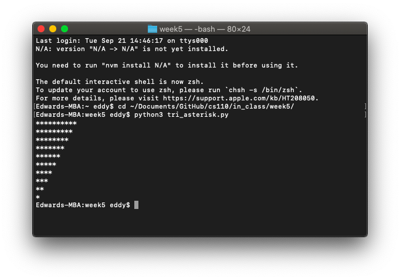
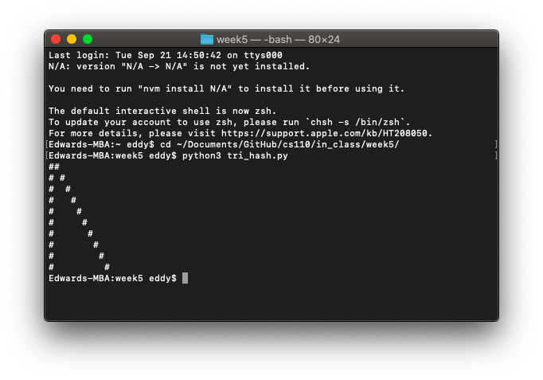
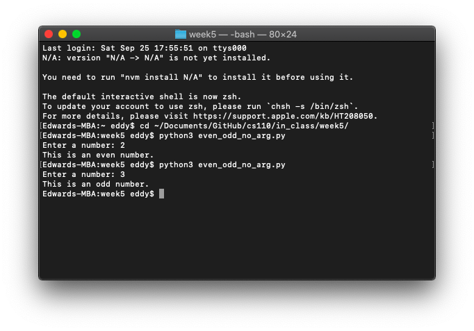
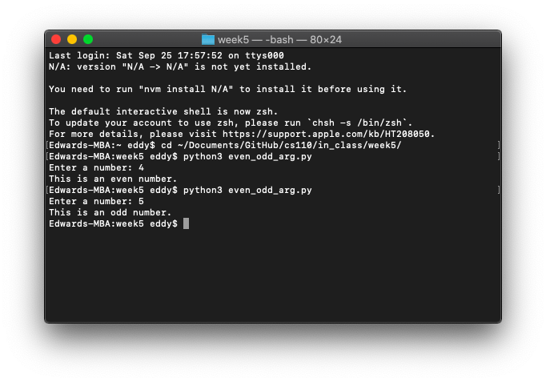
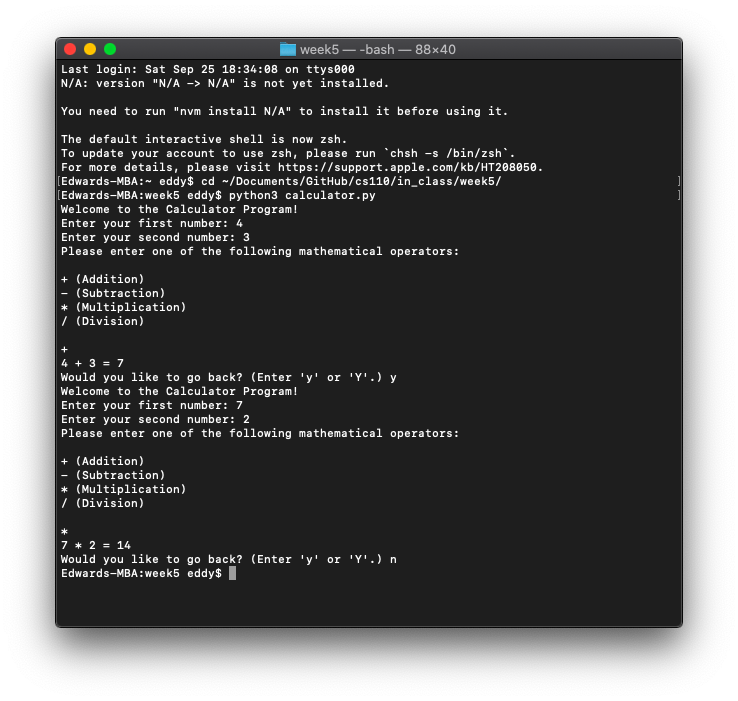

# Week 5

*September 21, 2021 – September 27, 2021*

## In-Class Exercise 6

### Part 1: Asterisks nested loop

Write a Python program `tri_asterisk.py` that uses nested `for` loops to draw this pattern (10 `*`s in the top row and 10 columns long):

```
*********
********
*******
******
*****
****
***
**
*
```

```python
for row in range(11, 1, -1):
    for column in range(row-1):
        print('*', end='')
    print()
```



### Part 2: Hashes nested loop

Write a Python program `tri_hash.py` that uses nested `for` loops to draw this pattern (10 columns long):

```
##
# #
#  #
#   #
#    #
#     #
#      #
#       #
#        #
#         #
```

```python
for row in range(0, 10, 1):
    print('#', end='')
    for column in range(row):
        print(' ', end='')
    print('#')
```



## 🧮 In-Class Exercise 7

### Part 1: Even or odd, no arguments

Write a Python program `even_odd_no_arg.py` which contains an `even_or_odd()` function that asks for user input, and based on the user's input, prints "This is an even number" or "This is an odd number."

Write a `main()` function that calls `even_or_odd()`.

Make sure you include a line that calls your `main()` function; otherwise your program will not execute. Do not use a global variable.

```python
def even_or_odd():
    num = int(input('Enter a number: '))
    if (num % 2) == 0:
        print('This is an even number.')
    else:
        print('This is an odd number.')


def main():
    even_or_odd()


main()
```



### Part 2: Even or odd, with arguments

Write a Python program `even_odd_arg.py` which contains an `even_or_odd(n)` function that takes in an argument `n` that prints "This is an even number" or "This is an odd number."

Write a `main()` function that gets an integer number from the user and call `even_or_odd(n)` and pass in the user's input.

Make sure you include a line that calls your `main()` function; otherwise your program will not execute. Do not use a global variable.

```python
def even_or_odd(n):
    if (n % 2) == 0:
        print('This is an even number.')
    else:
        print('This is an odd number.')


def main():
    n = int(input('Enter a number: '))
    even_or_odd(n)


main()
```



### Part 3: Calculator program

Write a Python program `calculator.py` that does the following: (Do not use a global variable.)

- Print a message that says "Welcome to the Calculator Program!"
- Ask the user for two numbers and store those two numbers in two separate variables.
- Ask the user to enter a mathematical operation (`+`, `-`, `*`, `/`) and save the user's choice in a variable. Display an error message if the user enters an invalid operation symbol.
- Define one function each for every mathematical operation in your program. Since your program will have at least four mathematical operators, you must have four separate functions named `add`, `subtract`, `multiply`, `divide`.
- Each of these functions must take two parameters/arguments. Each of these functions must have a local variable called `result`, where the result of performing that operation is stored.
- Display the result of performing the operation in the respective function. For example, in the `add` function, you must display the value in the `result` variable using the print function.
- Ask the user if s/he wants to continue and go back to the beginning if the user enters a `y` or `Y`. Hint: you will need a `while` loop for this.
- You need a `main` function to call your other functions (don't forget to call your `main`). You can print your message and put your while loop inside of your `main` function.

```python
def add(num1, num2):
    result = num1 + num2
    print(str(num1) + ' + ' + str(num2) + ' = ' + str(result))


def subtract(num1, num2):
    result = num1 - num2
    print(str(num1) + ' - ' + str(num2) + ' = ' + str(result))


def multiply(num1, num2):
    result = num1 * num2
    print(str(num1) + ' * ' + str(num2) + ' = ' + str(result))


def divide(num1, num2):
    result = num1 / num2
    print(str(num1) + ' / ' + str(num2) + ' = ' + str(result))


def main():
    go_back = 'y'
    while go_back == 'y' or go_back == 'Y':
        print('Welcome to the Calculator Program!')
        num1 = int(input('Enter your first number: '))
        num2 = int(input('Enter your second number: '))

        print('Please enter one of the following mathematical operators:\n')
        operator = input('+ (Addition)\n- (Subtraction)\n* (Multiplication) \n/ (Division)\n\n')

        while operator != '+' and operator != '-' and operator != '*' and operator != '/':
            operator = input('That\'s not a valid operator! Please reselect: ')

        if operator == '+':
            add(num1, num2)
            go_back = input('Would you like to go back? (Enter \'y\' or \'Y\'.) ')

        if operator == '-':
            subtract(num1, num2)
            go_back = input('Would you like to go back? (Enter \'y\' or \'Y\'.) ')

        if operator == '*':
            multiply(num1, num2)
            go_back = input('Would you like to go back? (Enter \'y\' or \'Y\'.) ')

        if operator == '/':
            divide(num1, num2)
            go_back = input('Would you like to go back? (Enter \'y\' or \'Y\'.) ')


main()
```


