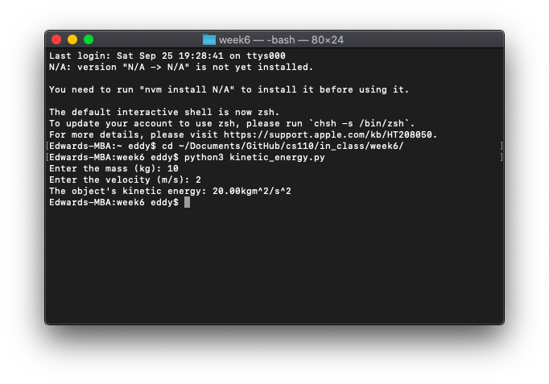
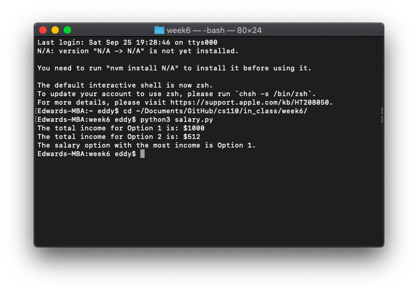

# Week 6

*September 28, 2021 – October 4, 2021*

## 💰 In-Class Exercise 8

### Part 1: Kinetic energy

In physics, an object that is in motion is said to have kinetic energy. The following formula can be used to determine a moving object's kinetic energy (KE):

> `KE = (m(v^2))/2`

The variables in the formula are as follows:

- `KE` is the kinetic energy;
- `m` is the object's mass in kilograms; and
- `v` is the object's velocity in meters per second.

Write a Python program `kinetic_energy.py` that contains a value-returning function named `kinetic_energy(mass, velocity)` that accepts an object's mass (in kilograms) and velocity (in meters per second) as arguments. The function should return the amount of kinetic energy that the object has.

In your `main`, ask the user to enter values for mass and velocity, then call the `kinetic_energy` function to get the object's kinetic energy and print to 2 decimal places.

```python
def kinetic_energy(mass, velocity):
    result = ((velocity ** 2) * mass) / 2
    return result


def main():
    mass = float(input('Enter the mass (kg): '))
    velocity = float(input('Enter the velocity (m/s): '))
    result = kinetic_energy(mass, velocity)
    print('The object\'s kinetic energy: ' + format(result, '.2f') + 'kgm^2/s^2')


main()
```



### Part 2: Salary

Write a Python program `salary.py` that offers two options to receive salary:

- Constant Salary: Receive $100 each day for 10 days
- Doubling Salary: $1 the first day, $2 the second day, $4 the third day, $8 the fourth day, doubling the amount each day, for 10 days.
- Define a function `constant_salary()` that computes the total income for Option 1 and returns the total.
- Define a function `doubling_salary()` that computes the total income for Option 2 and returns the total.
- Define a `main()` function that calls both functions and states the values for each salary. Compare the totals that are returned and determine which salary option is better.
- Call your `main()` function to start the program.

```python
def constant_salary():
    rate = 100
    days = 10
    total = rate * days
    return total


def doubling_salary():
    total = 1
    for num in range(1, 10, 1):
        # Note: normally, range would end at 11, but having total set to 1 is day 1, so run range for 9 more days
        total *= 2
    return total


def main():
    constant_salary_total = constant_salary()
    doubling_salary_total = doubling_salary()
    print('The total income for Option 1 is: $' + str(constant_salary_total))
    print('The total income for Option 2 is: $' + str(doubling_salary_total))
    print('The salary option with the most income is Option 1.')


main()
```


