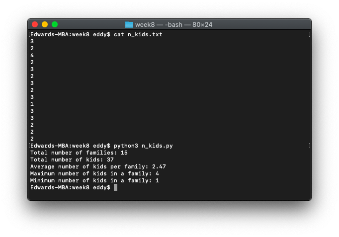
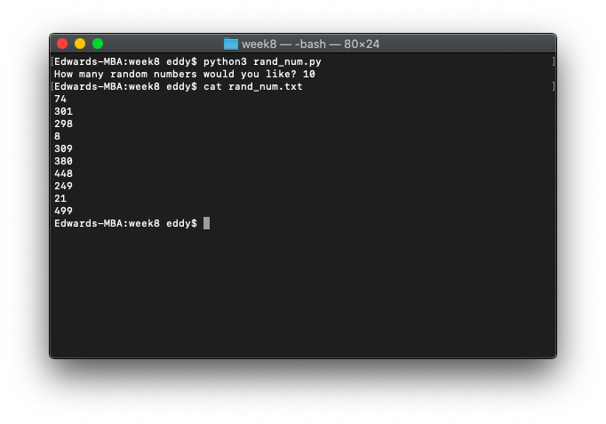

# Week 9

*October 19, 2021 – October 25, 2021*

## In-Class Exercise 9

### Part 1: Number of Kids

1. Grab the file `n_kids.txt` that contains data from the class on the number of kids your parents have (you + your siblings), one number per line.
2. Write a program `n_kids.py` that reads the data from `n_kids.txt`, does some math, then displays the following:
    - Total number of families
    - Total number of kids
    - Average number of kids per family (to 2 decimal places)
    - Maximum number of kids in a family
    - Minimum number of kids in a family
3. Extra credit: write the above results to a different file (`results.txt`, not to the input file `n_kids.txt`) in addition to displaying them on the screen.

Do not use built in `min` and `max` or similar functions.

```python
# Get n_kids.txt file
read_file = open('n_kids.txt', 'r')

# Set initial values
families = 0
kids = 0
smallest_number_of_kids = 10  # This value counts down, so purposely set high
largest_number_of_kids = 0

# Read first line to start while loop
line = read_file.readline()

# For each non-blank line, add one to families, add value of line to total kids count, and compare min and max kids
while line != '':
    line = line.lstrip('\ufeff')
    line = line.rstrip('\n')
    families += 1
    kids += int(line)
    if int(line) > largest_number_of_kids:
        largest_number_of_kids = int(line)
    if int(line) < smallest_number_of_kids:
        smallest_number_of_kids = int(line)
    line = read_file.readline()

read_file.close()

# Calculate average number of kids per family
avg_kids = format(kids / families, '.2f')

# Print values
print('Total number of families: ' + str(families))
print('Total number of kids: ' + str(kids))
print('Average number of kids per family: ' + str(avg_kids))
print('Maximum number of kids in a family: ' + str(largest_number_of_kids))
print('Minimum number of kids in a family: ' + str(smallest_number_of_kids))

# Write values to results.txt
write_file = open('results.txt', 'w')
write_file.write('Total number of families: ' + str(families) + '\n')
write_file.write('Total number of kids: ' + str(kids) + '\n')
write_file.write('Average number of kids per family: ' + str(avg_kids) + '\n')
write_file.write('Maximum number of kids in a family: ' + str(largest_number_of_kids) + '\n')
write_file.write('Minimum number of kids in a family: ' + str(smallest_number_of_kids) + '\n')
write_file.close()
```



### Part 2: Random Number File Writer

Write a program `rand_num.py` that writes a series of random numbers to a file `rand_num.txt`, one number per line. Each random number should be in the range of 1 through 500. The application should ask the user how many random numbers the file will hold with, "How many random numbers would you like?"

```python
import random

write_file = open('rand_num.txt', 'w')

lines = int(input('How many random numbers would you like? '))

for line in range(lines):
    number = random.randint(1, 500)
    write_file.write(str(number) + '\n')

write_file.close()
```


