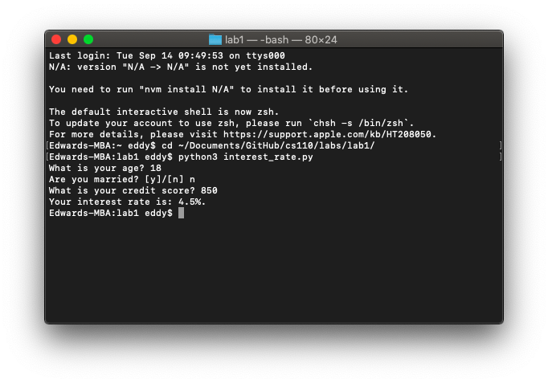
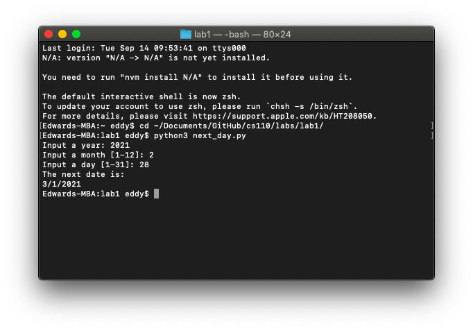

# Lab 1

*September 14, 2021*

---

### Part 1: Calculating interest rate

Write a Python program `interest_rate.py` that calculates the interest rate for a loan based on the individual's information:

(Please write comments above the main steps of your algorithm/code.)

- Use the starting interest rate as `3.5%`.
- Ask the user for their age, their marital status (e.g. `'Are you married? Type y or n'`), and their credit score.
    - If the user is under `25` years of age, then add `1.5` to the interest rate. i.e. `3.5 + 1.5`
    - If the user is equal to or over `50` years of age then, subtract `0.5` from the interest rate.
    - If the user is married, then decrease their interest rate by `0.75`.
    - If the user's credit score is less than `550`, then add `2.5` to their interest rate.
    - If the user's credit score is equal to or greater than `550` and less than `650`, then add `1.5` to their interest rate.
    - If the user's credit score is equal to or greater than `650`, then reduce their interest rate by `0.5`.
- At the end of the program, display the final interest rate to the user.

```python
# Set starting interest rate
interest_rate = 3.5  # Type float

# User questions
age = int(input('What is your age? '))
marital_status = input('Are you married? [y]/[n] ')
credit_score = int(input('What is your credit score? '))

# Age check
if age < 25:
    interest_rate += 1.5
elif age >= 50:
    interest_rate -= 0.5

# Marital status check
if marital_status == 'y':
    interest_rate -= 0.75

# Credit score check
if credit_score < 550:
    interest_rate += 2.5
elif 550 <= credit_score < 650:
    interest_rate += 1.5
elif credit_score >= 650:
    interest_rate -= 0.5

# Display final interest rate
print('Your interest rate is: ' + str(interest_rate) + '%.')
```



### Part 2: Determining the next day

Write a Python program `next_day.py` that gives the date of the next day based on a date provided by the user (year, month, day).

(Please write comments above the main steps of your algorithm/code.)

- The program should ask for input for the year, month, and day as follows:
    - Input a year:
    - Input a month [1-12]:
    - Input a day [1-31]:
- Then print out `'The next date is: '` and the date of the next day.
- You will need to consider the month_length of each month.
- You will need to use incrementation.
- The calculation of leap years is not needed for this section.
- For example, if the user enters `2035, 3, 16`, the program would print out `2035, 3, 17`.
- Do not use lists (as we have not learned them yet)!

```python
# Get date input from user
year = int(input('Input a year: '))
month = int(input('Input a month [1-12]: '))
day = int(input('Input a day [1-31]: '))

# Set month length based on input
month_length = 31  # Preset month length, all this does is remove IDE errors that say 'month_length is not defined'
if month < 1 or month > 12:
    print('Please pick a number between 1 and 12 for the different months!')  # Exit with error
elif month == 1:  # January
    month_length = 31
elif month == 2:  # February
    month_length = 28
elif month == 3:  # March
    month_length = 31
elif month == 4:  # April
    month_length = 30
elif month == 5:  # May
    month_length = 31
elif month == 6:  # June
    month_length = 30
elif month == 7:  # July
    month_length = 31
elif month == 8:  # August
    month_length = 31
elif month == 9:  # September
    month_length = 30
elif month == 10:  # October
    month_length = 31
elif month == 11:  # November
    month_length = 30
elif month == 12:  # December
    month_length = 31

# Date calculation
if day < 1 or day > month_length:  # Exit with error
    print('Please pick a number between 1 and ' + str(month_length) + '!')
elif 1 <= day <= month_length:
    if day == month_length:
        if month == 12:  # If it's the last day of the month AND it's December, increase year by 1
            day = 1
            month = 1
            year += 1
        elif month != 12:  # If it's the last day of the month, increase month by 1
            day = 1
            month += 1
    elif day != month_length:  # If it's a regular day, increase day by 1
        day += 1
    print('The next date is:')
    print(str(month), str(day), str(year), sep='/')
```



### Extra credit: Leap years

For extra credit, calculate leap years within your code for part 2 (that is years where February has 29 days).

- Every year that is exactly divisible by four is a leap year, except for years that are exactly divisible by 100, but these centurial years are leap years, if they are exactly divisible by 400.
    - For example, the years 1700, 1800, and 1900 were not leap years, but the years 1600 and 2000 were.
- [Hint: modulo operation calculates the remainder after division of one number by another. You have seen this with the % operator.]

```python
...

# Leap year calculation
leap = False  # Preset leap year value, all this does is remove IDE errors that say 'leap is not defined'
if year % 4 == 0:  # Divisible by 4
    if year % 100 == 0:  # Centurial year, not leap year by default
        if year % 400 == 0:  # If the centurial year is divisible by 400, it's a leap year
            leap = True
        elif year % 400 != 0:
            leap = False
    elif year % 100 != 0:
        leap = True
elif year % 4 != 0:
    leap = False

...

elif month == 2:  # February
    if not leap:  # If it's a common year, February has 28 days
        month_length = 28
    elif leap:  # If it's a leap year, February has 29 days
        month_length = 29

...
```

