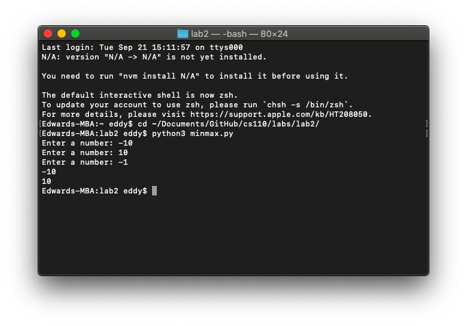
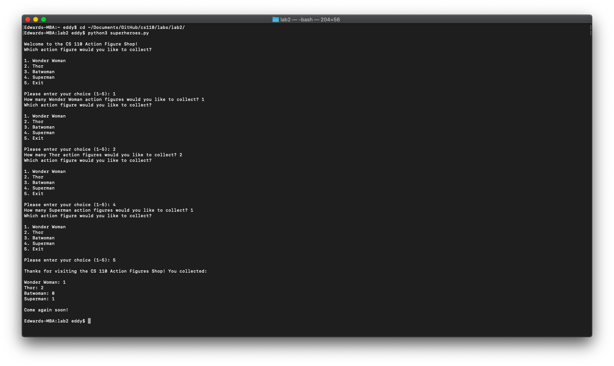

# Lab 2

*September 21, 2021*

---

### Part 1: Minimum and maximum values

Write a Python program `minmax.py`. ****This code should keep taking input from the user until the user enters a `-1`. When the user enters a `-1`, display the minimum value and the maximum value entered by the user up to that point.

Do not use minimum or maximum built-in functions.

```python
num = 0
minimum_value = 0
maximum_value = 0

while num != -1:
    num = int(input('Enter a number: '))
    if num == -1:
        print(minimum_value)
        print(maximum_value)
    elif num > maximum_value:
        maximum_value = num
    elif num < minimum_value:
        minimum_value = num
```



### Part 2: Interactive menu

Create an interactive program `superheroes.py` that displays this menu:

```
Welcome to the CS 110 Action Figure Shop!
Which action figure would you like to collect?

1. Wonder Woman
2. Thor
3. Batwoman
4. Superman
5. Exit

Please enter your choice (1-5):
```

**Do not use break or exit() or continue, we want you to use logic to understand how to do these problems.**

- After your code gets the user's choice, it should perform input validation to make sure the user entered a valid option (`1`-`5`).
- If the user entered an invalid value, your program should tell the user the value is invalid, redisplay the menu, and ask again for input. (You are welcome to use an if statement or a `while` loop for this.)
- For every valid entry (`1`-`4`), ask how many of that action figure the user would like to collect. For example, if the user enters `3`, ask "How many Batwomen would you like to collect?" and then get a number from the user.
    - You do not need to do input validation on this second number. Just add the number to the total for that action figure, redisplay the main menu, and wait for another menu-choice.
- If the user enters `5` to exit the main menu prompt, display the names and total number of each of the action figures collected and exit the program.

```python
#  Set initial values
choice = 1
wonder_woman_total = 0
thor_total = 0
batwoman_total = 0
superman_total = 0

#  Print main menu
print('\nWelcome to the CS 110 Action Figure Shop!')
while 1 <= choice <= 4:
    print('Which action figure would you like to collect?\n')
    print('1. Wonder Woman')
    print('2. Thor')
    print('3. Batwoman')
    print('4. Superman')
    print('5. Exit\n')

    choice = int(input('Please enter your choice (1-5): '))

    #  Input validation
    while choice < 1 or choice > 5:
        print('\nThat\'s not a valid choice!\n')
        print('1. Wonder Woman')
        print('2. Thor')
        print('3. Batwoman')
        print('4. Superman')
        print('5. Exit\n')
        choice = int(input('Please reselect: '))

    #  Wonder Woman submenu
    if choice == 1:
        wonder_woman_total += int(input('How many Wonder Woman action figures would you like to collect? '))

    # Thor submenu
    if choice == 2:
        thor_total += int(input('How many Thor action figures would you like to collect? '))

    # Batwoman submenu
    if choice == 3:
        batwoman_total += int(input('How many Batwoman action figures would you like to collect? '))

    # Superman submenu
    if choice == 4:
        superman_total += int(input('How many Superman action figures would you like to collect? '))

    # Exit option
    if choice == 5:
        print('\nThanks for visiting the CS 110 Action Figures Shop! You collected:\n')
        print('Wonder Woman: ' + str(wonder_woman_total))
        print('Thor: ' + str(thor_total))
        print('Batwoman: ' + str(batwoman_total))
        print('Superman: ' + str(superman_total))
        print('\nCome again soon!\n')
```


