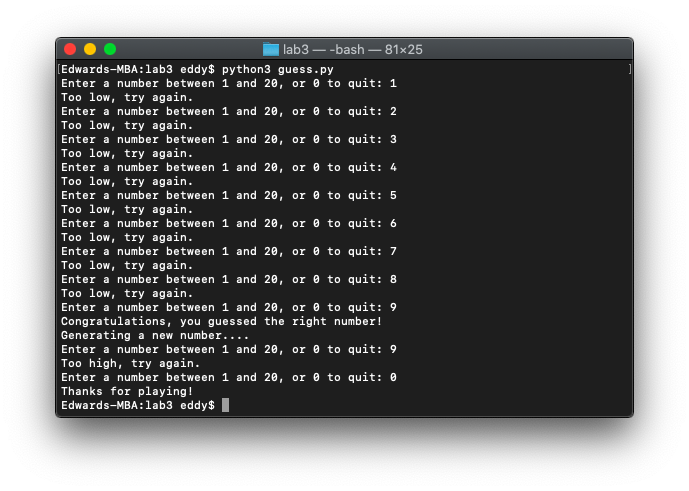

# 🤔 Lab 3

*October 12, 2021*

---

Write a program `guess.py` that generates a random number in the range of 1 through 20, and asks the user to guess what the number is.

If the user's guess is higher than the random number, the program should display, "Too high, try again." If the user's guess is lower than the random number, the program should display, "Too low, try again." If the user guesses the number, the application should congratulate the user and generate a new random number so the game can start over.

If the user enters `0`, they can exit out of the game.

Do not use a global variable. Do not use `break`, `exit()`, `continue`, etc.

Use the following code to have the computer pick a random number between 1 and 20:

```python
import random # Place this line at the top of your program

# Place the line below at the appropriate place in your program:

number = random.randint(1, 20) # Generates random number from 1 to 20
```

Write a value returning function `playGuessingGame(number)` that takes in the number that the computer randomly generated as a parameter. It should:

- Ask for the user's input by asking: "Enter a number between 1 and 20, or 0 to quit:"
- See if the guess is correct, and
- Return the user's guess (even if they enter zero).

If the user enters the correct number the function should congratulate them with, 'Congratulations! You guessed the right number!'

You do not need to worry about invalid values.

Write a `main` function that calls the `playGuessingGame` method and keeps looping through until the user enters zero. Once they exit out of the game print 'Thanks for playing!'

```python
import random

def play_guessing_game(number):
    guess = int(input('Enter a number between 1 and 20, or 0 to quit: '))
    if guess == 0:
        return guess
    elif guess < number:
        print('Too low, try again.')
        return guess
    elif guess > number:
        print('Too high, try again.')
        return guess
    elif guess == number:
        print('Congratulations, you guessed the right number!')
        return guess

def main():
    number = random.randint(1, 20)
    guess = play_guessing_game(number)
    while guess != 0:
        guess = play_guessing_game(number)
        if guess == number:
            print('Generating a new number....')
            number = random.randint(1, 20)
            guess = play_guessing_game(number)
    print('Thanks for playing!')

main()
```


