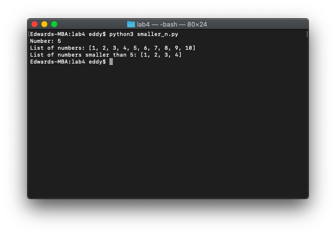

# 👶 Lab 4

*November 3, 2021*

---

### Part 1: Smaller-Than List

In a Python program `smaller_n.py`, write a function `smaller_than_n_list(input_list, n)` that accepts two arguments: an `input_list`, and a number `n`. Assume that the list contains numbers. The function should return a list of all of the numbers in the `input_list` that are less than the number `n`.

The program should have a `main()` function that initializes (hardcodes, no user input required) the list of numbers that you come up with (10 or so should do) and the number `n`. You should display the original list and the number `n`. Then display the list of numbers smaller than `n` by calling `smaller_than_n_list()` and display the returned results.

Example:

> Number: `6`
>
> List of numbers: `[1, 2, 3, 4, 5, 6, 7, 8, 9, 10]`
>
> List of numbers that are smaller than 6: `[1, 2, 3, 4, 5]`

```python
def smaller_than_n_list(input_list, n):
    output_list = []
    for num in input_list:
        if num < n:
            output_list.append(num)
    return output_list

def main():
    input_list = [1, 2, 3, 4, 5, 6, 7, 8, 9, 10]
    n = 5
    print('Number: ' + str(n))
    print('List of numbers: ' + str(input_list))
    print('List of numbers smaller than ' + str(n) + ': ' + str(smaller_than_n_list(input_list, n)))

main()
```



### Part 2: Girl and Boy Names

Note the following files:

- GirlNames.txt
    - This file contains a list of the 200 most popular names given to girls born in the United States from the year 2000 through 2009.
- BoyNames.txt
    - This file contains a list of the 200 most popular names given to boys born in the United States from the year 2000 through 2009.

Write a Python program `name_search.py` that reads the contents of the two files into two separate lists. You will need to strip the elements of each list of the newline. The user should be able to enter a boy's name, a girl's name, or both, and the application will display messages indicating whether the names were among the most popular.

You can ask the user the following:

- "Enter a boy's name, or N if you do not wish to enter a boy's name: "
- "Enter a girl's name, or N if you do not wish to enter a girl's name: "

To display the results you will want one of the following:

- "You chose not to enter a boy's name."
- "___ is one of the most popular boy's names."
- "___ is not one of the most popular boy's names."

AND one of the following:

- "You chose not to enter a girl's name."
- "___ is one of the most popular girl's names."
- "___ is not one of the most popular girl's names."

It is fine for the program to be case sensitive.

```python
boy_names_file = open('BoyNames.txt', 'r')
boy_names = boy_names_file.readlines()
boy_names_file.close()

girl_names_file = open('GirlNames.txt', 'r')
girl_names = girl_names_file.readlines()
girl_names_file.close()

index = 0
while index < len(boy_names):
    boy_names[index] = boy_names[index].rstrip('\n')
    index += 1

index = 0
while index < len(girl_names):
    girl_names[index] = girl_names[index].rstrip('\n')
    index += 1

boy_name_search_query = input('Enter a boy\'s name, or N if you do not wish to enter a boy\'s name: ')
girl_name_search_query = input('Enter a girl\'s name, or N if you do not wish to enter a girl\'s name: ')

if boy_name_search_query == 'N':
    print('You chose not to enter a boy\'s name.')
else:
    search = boy_name_search_query in boy_names
    if not search:
        print(boy_name_search_query + ' is not one of the most popular boy\'s names.')
    else:
        print(boy_name_search_query + ' is one of the most popular boy\'s names.')

if girl_name_search_query == 'N':
    print('You chose not to enter a girl\'s name.')
else:
    search = girl_name_search_query in girl_names
    if not search:
        print(girl_name_search_query + ' is not one of the most popular girl\'s names.')
    else:
        print(girl_name_search_query + ' is one of the most popular girl\'s names.')
```


### Extra Credit:

Create a new file `name_search_ec.py` that only searches for girls' names and loops until the user types `exit`. (So no need to search for boys' names!) In this version, you do not need to type `N`.

Search for the name the user entered like before and display whether this is a popular name or not.

Create a list of all the names that the user searched for (regardless of whether they were popular or not) before the program terminates and write that list to a separate .txt file called `NamesSearched.txt`. Make sure each item is on a newline in your file. And make sure `exit` is not one of the names printed or searched!

```python
girl_names_file = open('GirlNames.txt', 'r')
girl_names = girl_names_file.readlines()
girl_names_file.close()

names_searched_file = open('NamesSearched.txt', 'w')
names_searched = []

index = 0
while index < len(girl_names):
    girl_names[index] = girl_names[index].rstrip('\n')
    index += 1

girl_name_search_query = input('Enter a girl\'s name, or \'exit\' to stop searching: ')

while girl_name_search_query != 'exit':
    names_searched.append(girl_name_search_query)
    search = girl_name_search_query in girl_names
    if not search:
        print(girl_name_search_query + ' is not one of the most popular girl\'s names.')
    else:
        print(girl_name_search_query + ' is one of the most popular girl\'s names.')
    girl_name_search_query = input('Enter a girl\'s name, or \'exit\' to stop searching: ')

for name in names_searched:
    names_searched_file.write(str(name) + '\n')

names_searched_file.close()
```


