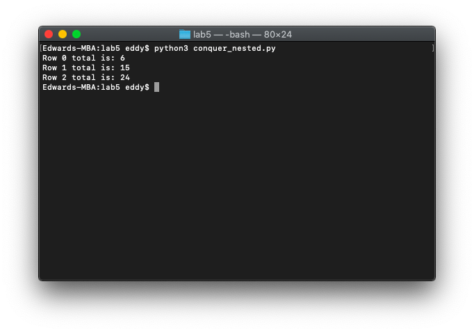
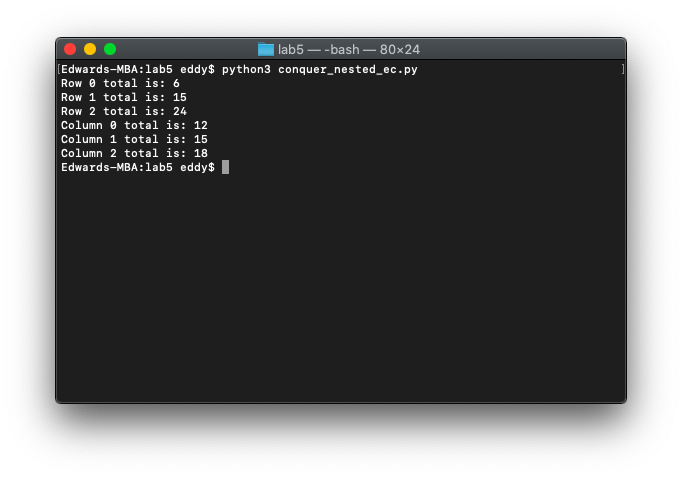

# 🪆 Lab 5

*November 10, 2021*

---

This lab is an opportunity to practice and conquer nested for loops and nested lists. The first part is required and the second part is extra credit. There is an opportunity here to get a lot of extra credit points.

### Part 1: Rows

Write a Python program `conquer_nested.py` which prints out the sum of each row of a 3x3 grid represented in a nested list using a nested for loop **by item only, using both target variables correctly**. And you want to print your output (shown below) using your for loop by item and not outside the nested for loop.

The grid must contain 9 different numbers.

Example:

```
4  9  2
3  5  7
8  1  6
```

This 3x3 grid is represented by: `[[4, 9, 2], [3, 5, 7], [8, 1, 6]]`.

Your output for this example should look like:

```
Row 0 total is: 15
Row 1 total is: 15
Row 2 total is: 15
```

For a 3x3 grid represented by `[[1, 3, 8], [2, 4, 6], [7, 9, 0]]`, your output should be:

```
Row 0 total is: 12
Row 1 total is: 12
Row 2 total is: 16
```

Using a ***nested for loop by item***, iterate through your nested list and sum each row and you want to print using your for loop by item and not outside the nested for loop.

Your code should work for any 3x3 grid with different numbers, but remember: **you must use a nested for loop by item!**

Please put your code in a void function such as `add_rows(table)` that takes in a list as an argument so that you can test your function with different lists of lists easily.

```python
grid = [[1, 2, 3],
        [4, 5, 6],
        [7, 8, 9]]


def add_rows(table):
    for row in table:
        row_sum = 0
        for col in row:
            row_sum += col
        print('Row ' + str(table.index(row)) + ' total is: ' + str(row_sum))


def main():
    add_rows(grid)


main()
```



### Extra Credit: Columns

Write a Python program `conquer_nested_ec.py` which prints out the sum of each row **and sum of each column** of a 3x3 grid represented in a nested list using a nested for loop *by item only*.

Your output for the example `[[4, 9, 2], [3, 5, 7], [8, 1, 6]]` should look like:

```
Row 0 total is: 15
Row 1 total is: 15
Row 2 total is: 15
Column 0 total is: 15
Column 1 total is: 15
Column 2 total is: 15
```

For a 3x3 grid represented by `[[1, 3, 8], [2, 4, 6], [7, 9, 0]]`, your output should be:

```
Row 0 total is: 12
Row 1 total is:12
Row 2 total is:  16
Column 0 total is: 10
Column 1 total is: 16
Column 2 total is: 14
```

Your code should work for any 3x3 grid with different numbers, but remember: **you must use a nested for loop by item!**

You may use indices to check which row you are on, in your conditionals when summing columns.

This second part is extra credit only so you will need to work more independently than the in-depth guidance that we normally provide.

```python
grid = [[1, 2, 3],
        [4, 5, 6],
        [7, 8, 9]]


def add_rows(table):
    col0_sum = 0
    col1_sum = 0
    col2_sum = 0


    for row in table:
        row_sum = 0
        for col in row:
            row_sum += col
            if row.index(col) == 0:
                col0_sum += col
            elif row.index(col) == 1:
                col1_sum += col
            elif row.index(col) == 2:
                col2_sum += col
        print('Row ' + str(table.index(row)) + ' total is: ' + str(row_sum))
    print('Column 0 total is: ' + str(col0_sum))
    print('Column 1 total is: ' + str(col1_sum))
    print('Column 2 total is: ' + str(col2_sum))


def main():
    add_rows(grid)


main()
```


