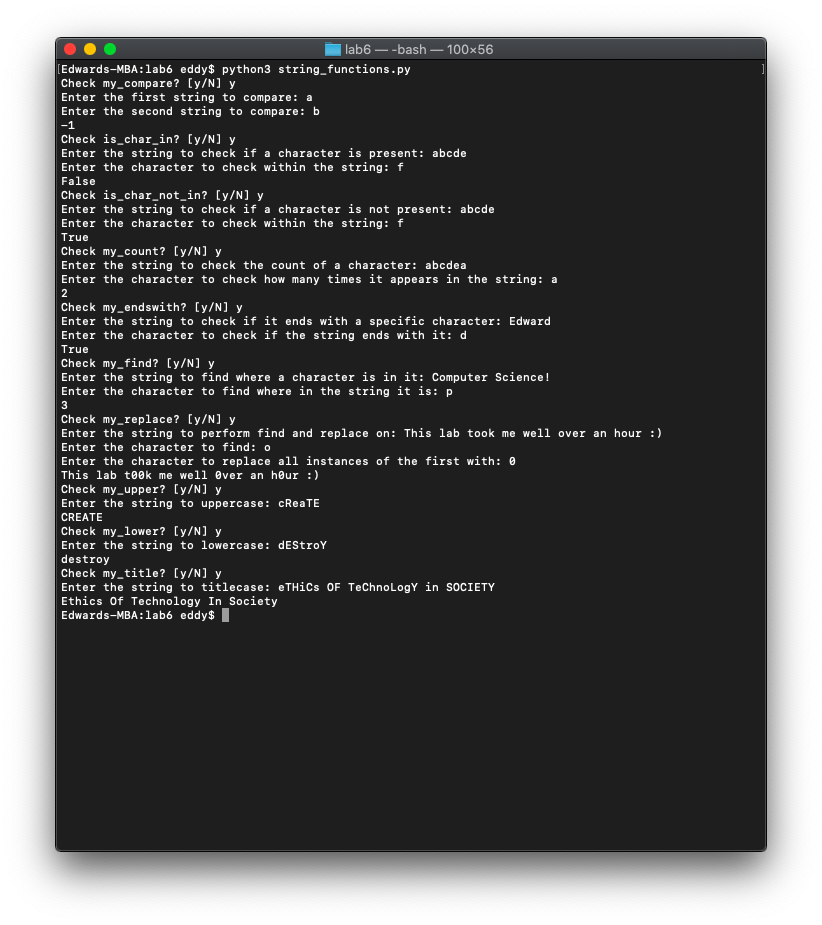

# 🧵 Lab 6

*November 15, 2021*

---

### Strings and Functions

Objectives:

- Practice defining functions with parameters
- Understand how string methods work by replacing them
- Implement your own version of string methods

Write a Python program `string_functions.py` that defines several functions. Each function re-implements Python's built-in string methods.

**Note:** You may not use Python's built-in string methods — e.g., `str.find()`, `str.replace()`, `str.lower()`, `lstrip()`, `startswith()`, `endswith()`, `join()`, `split()`, `index()`, and so on — to implement yours. You *can* use `in` and `not in`, and you can also use `<`, `>`, and `len`. **Make sure you test all your functions in the `main`.**

> My hint to you: remember that `return` ends the function definition and makes you return to where the function was called.

1. `my_compare(str1, str2)`
    - Takes two strings as parameters (`str1`, `str2`) and returns `-1` if `str1` is alphabetically less than `str2`, returns `0` if `str1` is alphabetically equal to `str2`, and returns a `1` if `str1` is alphabetically greater than `str2`.
2. `is_char_in(string, char)`
    - Takes a string and a character as parameters and returns `True` if the character *is* in the string or `False` if it is *not*.
3. `is_char_not_in(string, char)`
    - Takes a string and a character as parameters and returns `True` if the character is *not* in the string or `False` if it *is*.
4. `my_count(string, char)`
    - Takes a string and a character as parameters and returns an integer count for each occurrence of the character. For example, if the function takes in "abracadabra" and "a," the function should return `5`.
5. `my_endswith(string, char)`
    - Takes a string and a character as parameters and returns `True` if the character *is* the last character in the string or `False` if it is *not*. For example, if the function takes in "quartz" and "z," the function should return `True`. If the function takes in "quartz" and "q," the function should return `False`.
6. `my_find(string, char)`
    - Takes a string and a character as parameters and returns the first index from the left where the character is found. If it does not find the character, return `-1`. For example, if the function takes in "programming" and "g," it should return `3`. Do not use `str.find()` for this.
7. `my_replace(string, char1, char2)`
    - Takes a string and two characters (`char1` and `char2`) as parameters and returns a string with all occurrences of `char1` replaced by `char2`. For example, if the string is "bamboozle" and `char1` is "b" and `char2` is "t," then your function should return `tamtoozle`.
8. `my_upper(string)`
    - Takes a string as a parameter and returns it as a string in all uppercase. For example, "victory" would be "VICTORY." Hint: Use the `ord(c)` function to get the ASCII/Unicode code-point. For example, `ord('a')` returns the integer 97. Use `chr(i)` function to convert an integer back to a character. For example, `chr(97)` returns the string "a." You cannot use the built-in string function `str.upper()` for this. You do not have to test for mixed upper and lower case characters, such as "Victory," but I strongly recommend that you do as that will greatly help you do the extra credit question!
9. `my_lower(string)`
    - Takes a string as a parameter and returns it as a string in all lowercase. Hint: Similar to the previous item, use `ord()` and `chr()`. Do not use `str.lower()` for this. You do not have to test for mixed upper and lower case characters, such as "Victory," but I strongly recommend that you do as that will greatly help you do the extra credit question!

### Extra Credit

1. `my_title(string)`
    - Takes a string and returns a string with the first character capitalized for every word. For example, if the input to the function is, "I like Python a lot," the function should return the string, `"I Like Python A Lot"`. Test this for examples like "I like PYthon a lOt."

> **Check out the file `string_functions.py` for the solution!**

The result:

