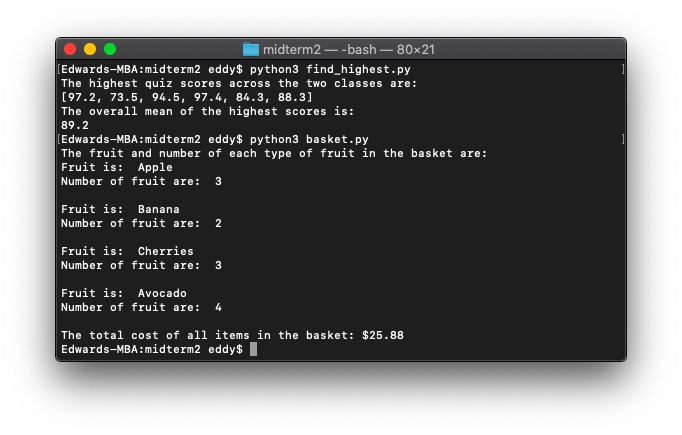

# 📝 Midterm 2

*December 2, 2021*

---

### Part 1: Find the highest mean

In a Python program, write a function `find_highest(listA, listB)` ****that accepts two lists as arguments. Each list contains fake mean quiz scores of two classes and look like this:

```python
classA = [80.0, 73.5, 94.5, 97.4, 84.3, 77.9]
classB = [97.2, 73.4, 94.5, 84.1, 76.9, 88.3]
```

The first element of each list contains the class mean of quiz 1, the second element contains the class mean of quiz 2, and so forth. Each list contains the mean score for 6 quizzes.

In your function `find_highest(listA, listB)`, go through the lists and pick the top quiz score between the two classes for each quiz. For example, you will compare the first element of each list and select the higher score (`80.0` vs. `97.2`), the second element of each list and select the highest score (`73.5` vs. `73.4`), and so on for each set of elements in the lists. Your function should return a list of the highest mean scores (this should be `[97.2, 73.5, 94.5, 97.4, 84.3, 88.3]`).

Create a `main` function where you initialize the following two lists (`classA` and `classB`) with the following elements:

```python
classA = [80.0, 73.5, 94.5, 97.4, 84.3, 77.9]
classB = [97.2, 73.4, 94.5, 84.1, 76.9, 88.3]
```

...and call your function `find_highest()` using those lists.

Using the list of highest scores that is returned from your function, calculate the overall **mean of all the highest scores** (`89.2`) and display the output as following:

```
The highest quiz scores across two classes are:
[97.2, 73.5, 94.5, 97.4, 84.3, 88.3]

The overall mean of the highest scores is:
89.2
```

**Do not use the built-in `min()`, `max()`, `sum()`, `mean()`, or similar functions.**

Do not hard-code your answers, i.e., they should be able to work with any pair of lists.

Hint: You do **not** need a nested for loop for this question.

```python
def find_highest(class_a_means, class_b_means):
    higher_means = []
    while len(class_a_means) != 0:
        if class_a_means[0] > class_b_means[0]:
            higher_means.append(class_a_means[0])
        else:
            higher_means.append(class_b_means[0])
        del(class_a_means[0])
        del(class_b_means[0])
    return higher_means


def calculate_mean(higher_means):
    total = 0
    for mean in higher_means:
        total += mean
    return total / len(higher_means)


def main():
    class_a_means = [80.0, 73.5, 94.5, 97.4, 84.3, 77.9]
    class_b_means = [97.2, 73.4, 94.5, 84.1, 76.9, 88.3]
    print('The highest quiz scores across the two classes are:')
    higher_means = find_highest(class_a_means, class_b_means)
    print(higher_means)
    print('The overall mean of the highest scores is:')
    print(calculate_mean(higher_means))


main()
```

### Part 2: Fruit shopping

You are provided with an incomplete Python code attached called `basket.py`.

Complete the Python program which has a dictionary `basket` to simulate a basket in a grocery store. The keys in the dictionary are strings representing items in the grocery store, such as `'Apple'` or `'Banana'`. For the purposes of this shopping trip, you are only going to buy fruit at the grocery store. The values in the dictionary are integers representing the number of those fruit, for example, a basket with two apples and one banana would be represented by:

`basket = {'Apple': 2, 'Banana': 1}`

There is also a dictionary `prices` which contains the fruit as the key and the price as the value.

Complete the provided functions in the code below which is provided for you marked by `TODO` in comments. Each function has a description above it in comments. Please note that the comments for each function are *above* the function.

There are three unfinished functions in the code which you need to complete:

`add_to_basket(basket, fruit, n)` ****is a void function which takes in the dictionary `basket`, a `fruit`, and the number `n`, representing the amount of that fruit you put in your basket, as arguments. Complete this function so that the fruit is added as the key and the number of items as the value. If the user already has one or more items of that fruit in their basket you will need to check and account for that when adding in more fruit.

`get_total(basket, prices)` is a value-returning function that takes in the dictionary `basket` and the dictionary `prices` as arguments and returns the total cost of all items in the basket. This is **one value**: the total cost of all the items in the basket. You must use the dictionaries `basket` and `prices` to do this (i.e. no hard-coding).

Complete the `main` by calling `show_items` and `get_total`. Print out the total cost of all items in the basket (a single amount) with a $ sign (no space between $ and numbers) and to two decimal places.

**Please do not convert your dictionary into a list or another datatype.**

```python
def main():
    basket = {}
    prices = {'Apple': 0.99,
              'Banana': 1.99,
              'Cherries': 2.99,
              'Avocado': 2.49
              }

    add_to_basket(basket, 'Apple', 2)
    add_to_basket(basket, 'Banana', 1)
    add_to_basket(basket, 'Cherries', 3)
    add_to_basket(basket, 'Avocado', 4)
    add_to_basket(basket, 'Apple', 1)
    add_to_basket(basket, 'Banana', 1)

    show_items(basket)
    total = get_total(basket, prices)
    print('The total cost of all items in the basket: $' + str(format(total, '.2f')))


def show_items(basket):
    print('The fruit and number of each type of fruit in the basket are:')
    for key in basket:
        print('Fruit is: ', key)
        print('Number of fruit are: ', basket[key])
        print()


def add_to_basket(basket, fruit, n):
    if fruit in basket:
        basket[fruit] += n
    else:
        basket[fruit] = n


def get_total(basket, prices):
    total = 0
    for fruit in basket:
        total += (prices[fruit] * basket[fruit])
    return total


main()
```

---

### Results


