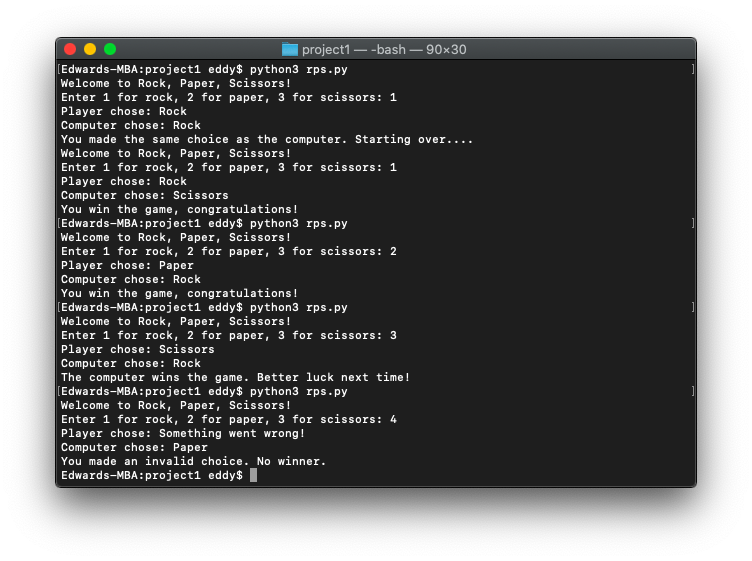

# 🪨 Project 1

*October 22, 2021*

---

Write a Python program `rps.py` that lets the user play the game of Rock, Paper, Scissors against the computer.

The program should work as follows:

- For this program, `1` represents rock, `2` represents paper, and `3` represents scissors.
- In your `main` function:
    - Ask the user to choose rock, paper, or scissors like so: "Enter 1 for rock, 2 for paper, 3 for scissors: " set the value to a variable called `player`.
    - Generate a random number between 1 and 3 for the computer. Set that value to a variable called `computer`. If the number is 1, then the computer has chosen rock. If the number is 2, then the computer has chosen paper. If the number is 3, then the computer has chosen scissors. (Don't display the computer's choice yet.)
    - Call your `choiceString(choice)` function to print the computer's hand like so: "Computer chose...."
    - Call your `choiceString(choice)` function to print the player's hand like so: "Player chose...."
    - Call your value returning function `rockPaperScissors(computer, player)` to get the result of the round between the computer and player.
    - If the result is tie, print, "You made the same choice as the computer. Starting over," and repeat the process until there is no tie.
    - Declare if the computer is the winner with, "The computer wins the game" or whether the player is the winner with, "You win the game," or, if there was an invalid choice, print, "You made an invalid choice. No winner." If they made an invalid choice you do not need to loop through again.
- In the `main`, please comment each of the above bullet points.
- Outside of your `main`, define the following functions:
    - `rockPaperScissors(computer, player)` (value-returning function)
        - This takes in integers representing the computer and player's "hands," so to speak, of rocks, papers, or scissors as arguments.
        - It returns one of the following values: `TIE`, `PLAYER_WINS`, `COMPUTER_WINS`, or `INVALID`
        - Using conditionals, based on the arguments passed into the function, determine which value to return based on these rules:
            - If one player chooses rock and the other player chooses scissors, then rock wins. (Rock smashes scissors.)
            - If one player chooses scissors and the other player chooses paper, then scissors wins. (Scissors cuts paper.)
            - If one player chooses paper and the other player chooses rock, then paper wins. (Paper wraps rock.)
            - If both players make the same choice, the game must be played again to determine the winner.
    - `choiceString(choice)` (value-returning function)
        - Takes in the argument choice (the number representing rock, paper, or scissors) and return one of the following strings: `'rock'`, `'paper'`, `'scissors'`, or `'Something went wrong'`
        - In other words, the function returns the string value of the integer being passed in as an argument.

```python
# Inputs:
# ROCK = 1
# PAPER = 2
# SCISSORS = 3

# Results:
# TIE
# COMPUTER_WINS
# PLAYER_WINS
# INVALID

def main():
    tie = 1
    while tie == 1:
        print('Welcome to Rock, Paper, Scissors!')

        # Get user input
        player = int(input('Enter 1 for rock, 2 for paper, 3 for scissors: '))

        # Generate random number
        import random
        computer = random.randint(1, 3)

        # Print player hand
        choice = player
        result = choice_string(choice)
        print('Player chose: ' + str(result))

        # Print computer hand
        choice = computer
        result = choice_string(choice)
        print('Computer chose: ' + str(result))

        # Run round and print result
        result = rock_paper_scissors(computer, player)
        if result == 'TIE':
            tie = 1  # Run the game again
            print('You made the same choice as the computer. Starting over....')
        elif result == 'COMPUTER_WINS':
            tie = 0  # Won't loop the game again
            print('The computer wins the game. Better luck next time!')
        elif result == 'PLAYER_WINS':
            tie = 0  # Won't loop the game again
            print('You win the game, congratulations!')
        elif result == 'INVALID':
            tie = 0  # Won't loop the game again
            print('You made an invalid choice. No winner.')

def rock_paper_scissors(computer, player):
    if computer == 1:  # Computer chooses rock
        if player == 1:  # Player chooses rock
            result = 'TIE'
            return result
        elif player == 2:  # Player chooses paper
            result = 'PLAYER_WINS'
            return result
        elif player == 3:  # Player chooses scissors
            result = 'COMPUTER_WINS'
            return result
        else:
            result = 'INVALID'
            return result
    elif computer == 2:  # Computer chooses paper
        if player == 1:  # Player chooses rock
            result = 'COMPUTER_WINS'
            return result
        elif player == 2:  # Player chooses paper
            result = 'TIE'
            return result
        elif player == 3:  # Player chooses scissors
            result = 'PLAYER_WINS'
            return result
        else:
            result = 'INVALID'
            return result
    elif computer == 3:  # Computer chooses scissors
        if player == 1:  # Player chooses rock
            result = 'PLAYER_WINS'
            return result
        elif player == 2:  # Player chooses paper
            result = 'COMPUTER_WINS'
            return result
        elif player == 3:  # Player chooses scissors
            result = 'TIE'
            return result
        else:
            result = 'INVALID'
            return result
    else:
        result = 'INVALID'
        return result

def choice_string(choice):
    if choice == 1:
        result = 'Rock'
        return result
    elif choice == 2:
        result = 'Paper'
        return result
    elif choice == 3:
        result = 'Scissors'
        return result
    else:
        result = 'Something went wrong!'
        return result

main()
```


