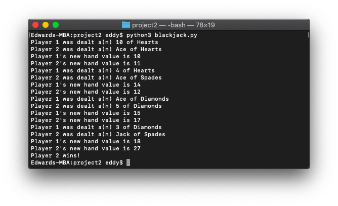

# 🃏 Project 2

*December 8, 2021*

---

## Blackjack

You saw the `card_dealer.py` program that simulates cards being dealt from a deck. We are going to enhance this program so it simulates a simplified version of the game of Blackjack between two virtual players. As you can see, this is not really Blackjack, but a very simplified version! So you Blackjack aficionados out there will have to forget about the real Blackjack!

The cards have the following values:

- Numeric cards are assigned the value they have printed on them. For example, the value of the 2 of Spades is `2`, and the value of the 5 of Diamonds is `5`.
- Jacks, Queens, and Kings are valued at `10`.
- Aces are valued at `1` or `11`, depending on the conditions described below.

The program should deal cards *arbitrarily* and at the same time to each player until one player's hand is worth more than 21 points. When that happens, the other player is the winner. It is possible that both players' hands will simultaneously exceed 21 points, in which case neither player wins.

If a player is dealt an Ace, the program should decide the value of the card according to the following rule: The Ace will be worth 11 points, unless that makes the player's hand exceed 21 points. In that case, the ace will be worth 1 point.

You have been provided with starter code `blackjack_starter.py`. You need to follow and complete the starter code.

It is recommended that you print out data structures such as the `deck` and the list `numbers` to understand how they work.

Oftentimes, in the real world, you will start off with code that is already written and part of your job will be understanding it and then adding to it.

It is important you have a clear understanding of how the deck is stored in the dictionary and what the key is and what the value is.

Extra Credit:

For the main question you only need to deal cards *arbitrarily*. For extra credit, deal the cards *randomly* from the deck.

### `blackjack_starter.py`

```python
# Blackjack starter code

# Global constant for the winning number of cards
MAX = 21

# main function
def main():
    # Local variables
    hand1 = 0
    hand2 = 0
    deck = create_deck()

    #TODO - Deal a card to each player and calculate hand value. 
    #Print 'Player 1 was dealt...'
    #Print 'Player 2 was dealt...'


    #TODO Determine the winner.
    #Print either:
    #Print 'There is no winner' or
    #'Player 1 wins' or
    #'Player 2 wins'


# The create_deck function creates a deck of cards and
# returns the deck.
def create_deck():
    # Set up local variables
    suits = ['Spades','Hearts','Clubs','Diamonds']
    special_values = {'Ace':1, 'King':10, 'Queen':10, 'Jack':10}

    # Create list of all the card values
    numbers = ['Ace', 'King', 'Queen', 'Jack']
    for i in range(2,11):
        numbers.append(str(i))

    # Initialize deck
    deck = {}
    for suit in suits:
        for num in numbers:
            #TODO Add the numbers 2-10 to the deck [Hint: you will need to check if the value is numeric]

            #TODO Add the Ace, King, Queen, or Jack values to the deck using the dictionary special_values.
    return deck

# TODO Given the player's current hand, the value of the card they were just dealt
# and the name of the card they were just dealt, return the new value of their hand 
# Remember: If a player is dealt an ace, the program should decide the value by:
# The ace will be worth 11 points, uless that makes the player's hand exceed 21 points.
# In that case the ace will be worth 1 point.
def update_hand_value(hand, value, card):
  

# Call the main function
main()
```

### `blackjack.py`

```python
import random

MAX = 21


def main():
    hand1 = 0
    hand2 = 0
    deck = create_deck()

    end_game = 0
    while end_game == 0:

        # Game not over yet, continue adding cards
        if hand1 < MAX and hand2 < MAX:
            hand1_card = random.choice(list(deck.keys()))
            hand2_card = random.choice(list(deck.keys()))
            print('Player 1 was dealt a(n) ' + hand1_card)
            print('Player 2 was dealt a(n) ' + hand2_card)
            hand1_card_value = deck[hand1_card]
            hand2_card_value = deck[hand2_card]
            hand1 = update_hand_value(hand1, hand1_card_value, hand1_card)
            hand2 = update_hand_value(hand2, hand2_card_value, hand2_card)
            print('Player 1\'s new hand value is ' + str(hand1))
            print('Player 2\'s new hand value is ' + str(hand2))
            end_game = 0

        # Tie
        elif hand1 >= MAX and hand2 >= MAX:
            print('There is no winner.')
            end_game = 1

        # Player 1 wins
        elif hand1 >= MAX > hand2:
            print('Player 1 wins!')
            end_game = 1

        # Player 2 wins
        elif hand1 < MAX <= hand2:
            print('Player 2 wins!')
            end_game = 1


def create_deck():
    suits = ['Spades', 'Hearts', 'Clubs', 'Diamonds']
    special_values = {'Ace': 1, 'King': 10, 'Queen': 10, 'Jack': 10}

    numbers = ['Ace', 'King', 'Queen', 'Jack']
    for i in range(2, 11):
        numbers.append(i)

    deck = {}
    for suit in suits:

        for num in numbers:
            if type(num) == int:
                deck.update({str(num) + ' of ' + suit: num})

        for special_value in special_values:
            deck.update({special_value + ' of ' + suit: special_values[special_value]})

    return deck


def update_hand_value(hand, value, card):
    if 'Ace' in card:
        value = 11
        hand += value
        if hand > MAX:
            hand -= 10
            return hand
        else:
            return hand
    else:
        hand += value
        return hand


main()
```


